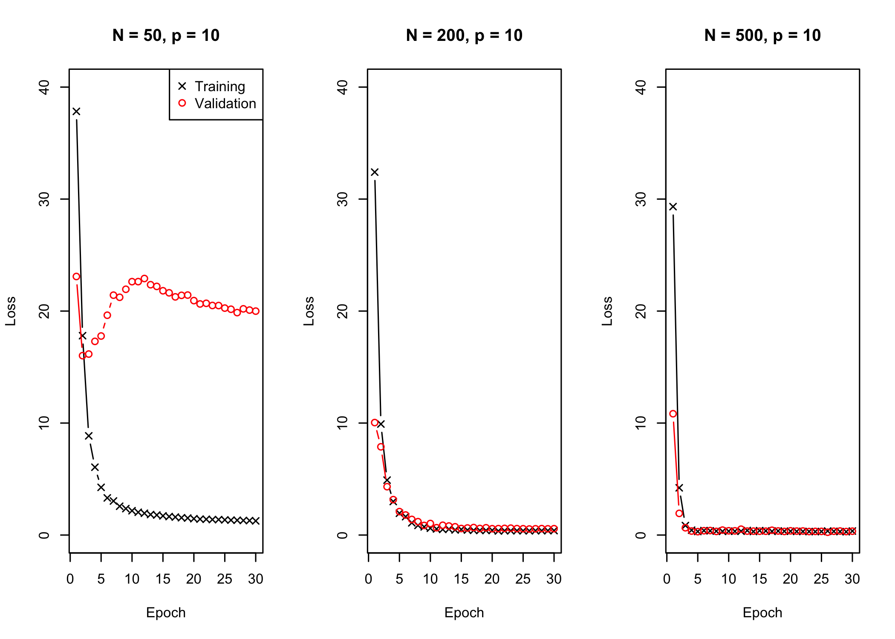
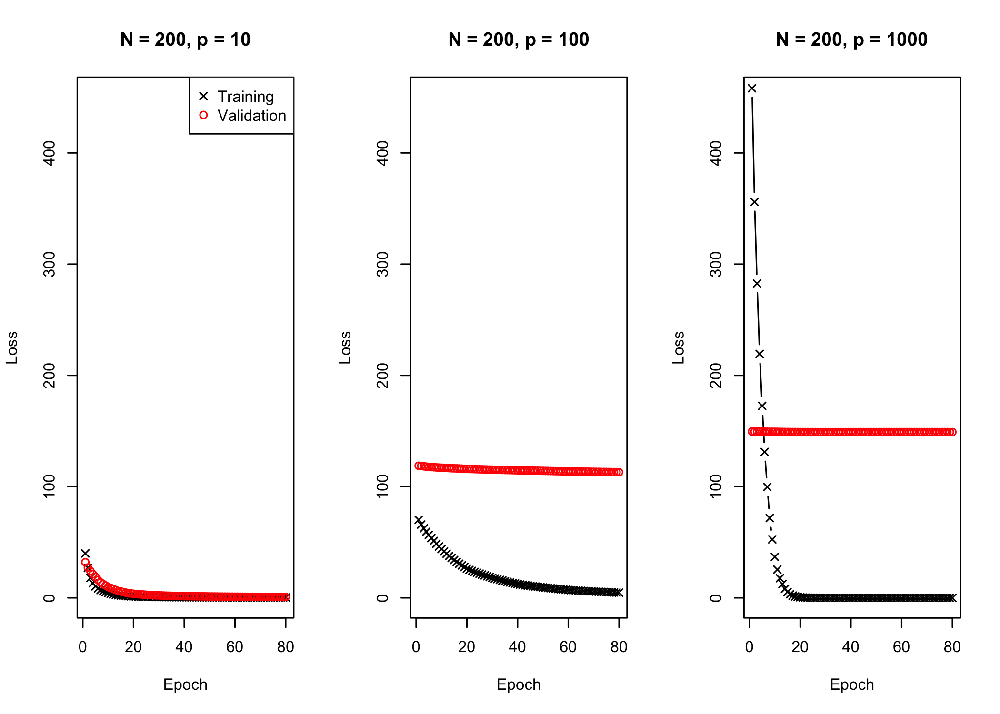
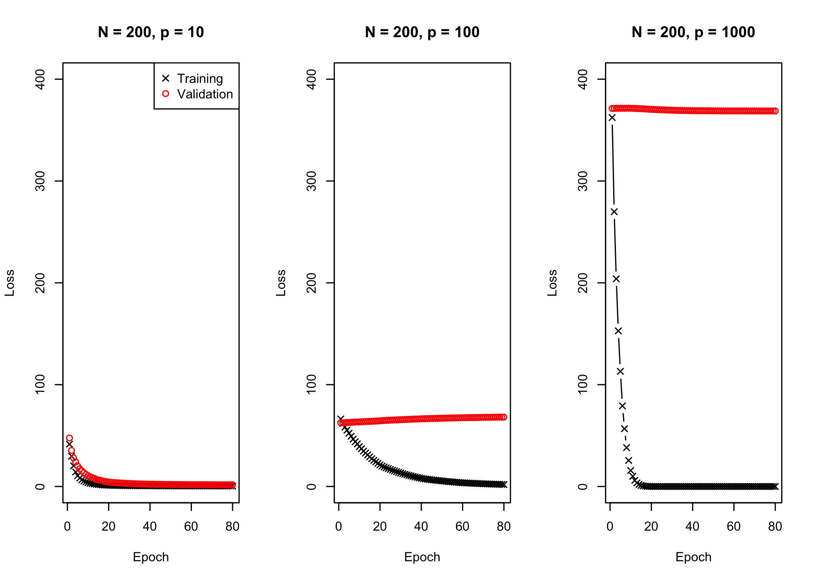

Simulations
================

## SDG vs. Adam:

see <https://medium.com/mdr-inc/from-sgd-to-adam-c9fce513c4bb>

SGD challenges: - sparse data set where some features are frequently
occurring and others are rare -\> opting for a same learning rate for
all the parameters will not be a good idea. We would want to make a
larger update for the rarely occurring ones as compared to the
frequently occurring features

  - challenge: choosing a proper learning rate. Very large learning
    rate: dwindle around the minimum, very small learning rate: the
    convergence gets really slow.

  - In the neural networks domain one of the issue we face with the
    highly non convex functions is that one gets trapped in the numerous
    local minimas

Adam:

  - Adaptive Moment Estimation (Adam) is a good alternative to SGD

  - inherits itself from Adagrad and RMSProp

Adagrad:

  - works better for sparse data by adapting the learning rate to the
    parameters, bu having a low learning rate for the parameters
    associated to frequently occuring features and larger updates to the
    ones with infrequent features

  - while SGD has a common learning rate for all param. Adagrad uses
    different learning rates for the parameters at every timestep.

  - but learning rate becomes infinitesimally small.

RMSprop:

  - alternative to Adagrad

\-\> Adam is a combination of both

## HierNet in the LassoNetR framework

``` python
from torch.nn.parameter import Parameter
from torch.nn import functional as F


# %% Define HierNet
class torch_hiernet(torch.nn.Module):
#     """
#     2-layer NN with RelU
#     """
     def __init__(self, D_in, D_out, H):
         super().__init__()
         self.D_in = D_in
         self.D_out = D_out
         #self.W = Parameter(torch.randn((D_in, D_in)))
         self.W1 = torch.nn.Linear(D_in, D_in, bias = False)
         return

     def forward(self, x):
         y = F.linear(x, self.W1.weight)
         # sum over dim 1, insert dummy dimension
         z = (x*y).sum(1)[:,None]
         return z
```

``` r
source("R/reticulate_setup.R")
source("R/LassoNetR.R")
```

``` r
fit_all <- list()
D_in = 10L
D_out = 1L
batch_size = 5L

i = 0
for(N in c(50L, 200L, 500L)){
  
  i = i + 1
  X = matrix(rnorm(N * D_in), N, D_in)
  y = 1 * X[, 1] + 2. * X[, 2] - 3*X[, 3] +
    5*X[, 5] - 1.*X[, 1]*X[, 2] + 2*X[, 5]*X[,6]
  H = N/10L
  fit_all[[i]] <- LassoNetR(X = X, Y = y, 
                            NN = py$torch_hiernet, 
                            D_in = D_in, D_out = D_out, H = H, 
                            batch_size=batch_size, lam = 5L, M = 1L, 
                            n_epochs = 30L, valid = TRUE, optimizer = "SGD")
}
```

Training and validation loss comparison

<!-- -->

``` r
fit_all_p <- list()
D_out = 1L
batch_size = 5L
N = 200L
H = 20L
i = 0
optim = c("SGD", "ADAM", "ADAM")
for(D_in in c(10L, 100L, 1000L)){
  
  i = i + 1
  ## different alpha for different p
  al0 = c(1e-3, 1e-4, 1e-5)
  X = matrix(rnorm(N * D_in), N, D_in)
  y = 1 * X[, 1] + 2. * X[, 2] - 3*X[, 3] +
    5*X[, 5] - 1.*X[, 1]*X[, 2] + 2*X[, 5]*X[,6]
  fit_all_p[[i]] <- LassoNetR(X = X, Y = y, 
                            NN = py$torch_hiernet, 
                            D_in = D_in, D_out = D_out, H = H, 
                            batch_size=batch_size, lam = 5L, M = 1L, 
                            n_epochs = 80L, valid = TRUE, optimizer = optim[i],
             alpha0 = al0[i])
}
```

<!-- -->

## LassoNet with Feed Forward architecture

``` python
from torch.nn.parameter import Parameter
from torch.nn import functional as F

class FeedForward(torch.nn.Module):
    """
    2-layer NN with RelU
    """

    def __init__(self, D_in, D_out, H):
        super().__init__()
        self.D_in = D_in
        self.D_out = D_out

        self.W1 = torch.nn.Linear(D_in, H, bias=True)
        self.relu = torch.nn.ReLU()
        self.W2 = torch.nn.Linear(H, H)
        self.W3 = torch.nn.Linear(H, D_out)
        return

    def forward(self, x):
        x = self.W1(x)
        x = self.relu(x)
        x = self.W2(x)
        x = self.relu(x)
        x = self.W3(x)
        return x
```

``` r
fit_allFF <- list()
D_in = 10L
D_out = 1L
batch_size = 5L

i = 0
for(N in c(50L, 200L, 500L)){
  
  i = i + 1
  X = matrix(rnorm(N * D_in), N, D_in)
  y = 1 * X[, 1] + 2. * X[, 2] - 3*X[, 3] +
    5*X[, 5] - 1.*X[, 1]*X[, 2] + 2*X[, 5]*X[,6]
  H = N/10L
  class(H) <- "integer"
  fit_allFF[[i]] <- LassoNetR(X = X, Y = y, 
                            NN = py$FeedForward, 
                            D_in = D_in, D_out = D_out, H = H, 
                            batch_size=batch_size, lam = 5L, M = 1L, 
                            n_epochs = 30L, valid = TRUE, optimizer = "SGD")
}
```

Training and validation loss comparison

<!-- -->

``` r
fit_allFF_p <- list()
D_out = 1L
batch_size = 20L
N = 200L
H = 20L
i = 0
optim = c("SGD", "ADAM", "ADAM")
for(D_in in c(10L, 100L, 1000L)){
  
  i = i + 1
  ## different alpha for different p
  al0 = c(1e-3, 1e-4, 1e-5)
  X = matrix(rnorm(N * D_in), N, D_in)
  y = 1 * X[, 1] + 2. * X[, 2] - 3*X[, 3] +
    5*X[, 5] - 1.*X[, 1]*X[, 2] + 2*X[, 5]*X[,6]
  fit_allFF_p[[i]] <- LassoNetR(X = X, Y = y, 
                            NN = py$torch_hiernet, 
                            D_in = D_in, D_out = D_out, H = H, 
                            batch_size=batch_size, lam = 5L, M = 1L, 
                            n_epochs = 80L, valid = TRUE, optimizer = optim[i],
             alpha0 = al0[i])
}
```

<!-- -->

## Does the validation loss get besser for larger M (M = 500)?

``` r
fit_allFF_pM <- list()
D_out = 1L
batch_size = 20L
N = 200L
H = 20L
i = 0
optim = c("SGD", "ADAM", "ADAM")
for(D_in in c(10L, 100L, 1000L)){
  
  i = i + 1
  ## different alpha for different p
  al0 = c(1e-3, 1e-4, 1e-5)
  X = matrix(rnorm(N * D_in), N, D_in)
  y = 1 * X[, 1] + 2. * X[, 2] - 3*X[, 3] +
    5*X[, 5] - 1.*X[, 1]*X[, 2] + 2*X[, 5]*X[,6]
  fit_allFF_pM[[i]] <- LassoNetR(X = X, Y = y, 
                            NN = py$torch_hiernet, 
                            D_in = D_in, D_out = D_out, H = H, 
                            batch_size=batch_size, lam = 5L, M = 500L, 
                            n_epochs = 80L, valid = TRUE, optimizer = optim[i],
             alpha0 = al0[i])
}
```

<!-- -->
