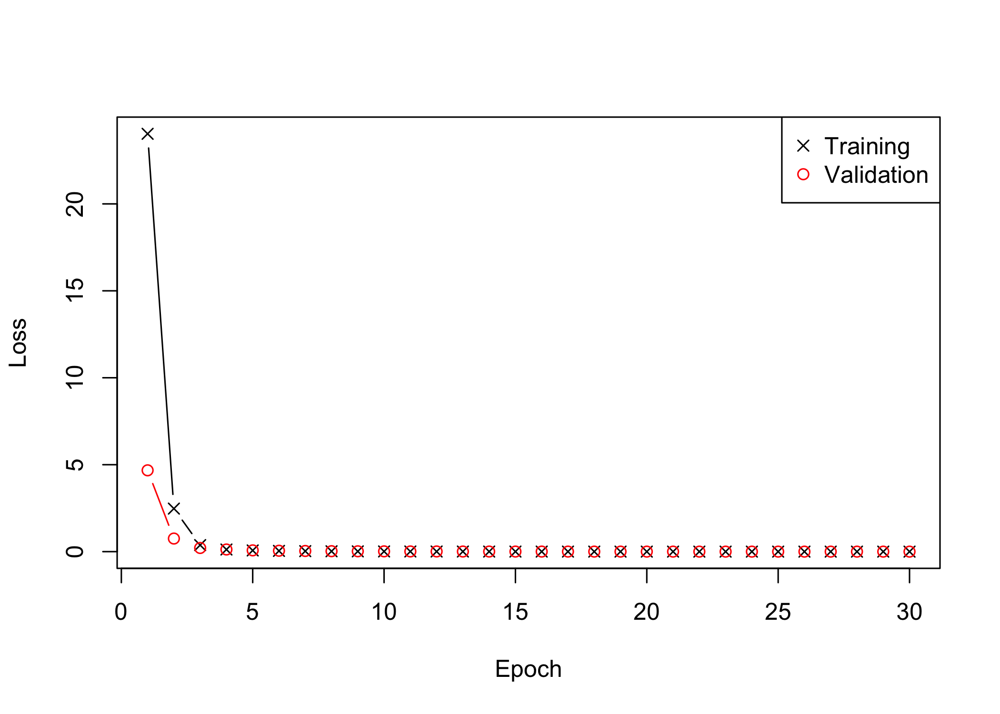

hierNet versus LassoNet
================

Here we compare hierNet with weak hierarchy to LassoNet with a quadratic
hidden layer.

``` python
#% import python modules
import numpy as np
import matplotlib.pyplot as plt
import torch
from torch.optim.lr_scheduler import StepLR
from torch.utils.data import Dataset, DataLoader
from sklearn.preprocessing import StandardScaler
from sklearn.preprocessing import scale
from sklearn.model_selection import train_test_split
from sklearn.metrics import mean_squared_error
import pandas as pd
from sklearn.metrics import mean_squared_error as rmse
from numpy import genfromtxt
```

\(y = 1x_1 + 2x_2 -3x_3 + 5x_5-1x_1x_2 +2x_5x_6\)

``` python
#% from prep_data import read_data, create_predicition_csv
#% import github repository lassonet reimplementation Fabian
path_lassonet = "/Users/mara.stadler/LRZ Sync+Share/PhD/WiDS2022/lassonet-fabian/"
import sys
sys.path.append(path_lassonet)
from module import LassoNet


torch.manual_seed(42)
```

    ## <torch._C.Generator object at 0x7fc939b9a530>

``` python
np.random.seed(42)

#% Data simulation
D_in = 10 # input dimension
D_out = 1 # output dimension
H = 10 * 11 # hidden layer size

N = 1000 # training samples
batch_size = 15

def generate_toy_example(N):
    X = torch.randn(N, D_in)  
    #%y = 1.*X[:, 3] - 1.*X[:, 3]**2 + 1.*X[:, 1] + 0.5*X[:, 2] + 2 * X[:, 4] * X[:, 5]
    y = 1.*X[:, 0] + 2.*X[:, 1] - 3*X[:, 2] + 5*X[:, 4] - 1.*X[:, 0]*X[:, 1] + 2*X[:, 4]*X[:,5]
    return X, y.reshape(-1,1)

XX_train, yy_train = generate_toy_example(N)
XX_valid, yy_valid = generate_toy_example(1000)

#% standardize data
scaler = StandardScaler()
XX_train = scaler.fit_transform(XX_train)
XX_valid = scaler.fit_transform(XX_valid)

#% convert data to tensor format
XX_train = torch.tensor(XX_train).float()
XX_valid = torch.tensor(XX_valid).float()

#% Numpy array (readable in R)
XX_train_np = XX_train.detach().numpy()
yy_train_np = yy_train.detach().numpy()

XX_valid_np = XX_valid.detach().numpy()
yy_valid_np = yy_valid.detach().numpy()
```

## hierNet with weak hierarchy

``` r
dim(py$XX_train_np)
dim(py$yy_train_np)

X = py$XX_train_np
y = py$yy_train_np
y = as.vector(y)

fitpath = hierNet::hierNet.path(x = X, y = y, strong = F)
fitcv = hierNet::hierNet.cv(fitpath, x = X, y = y)

# plot(fitcv)
fitcv$lamhat.1se
fitfinal = hierNet::hierNet(X, y, lam = fitcv$lamhat.1se)
fitfinal
```

OOS prediction `hierNet`

``` r
X_valid = py$XX_valid_np
y_valid = py$yy_valid_np
y_valid = as.vector(y_valid)
yhat <- predict(fitfinal, as.matrix(X_valid))

rmse <- sqrt(mean((yhat - y_valid)^2))
rmse
```

    ## [1] 0.6452872

### LassoNet with linear + quadratic architecture

``` python
# %% Create DataLoader (see https://pytorch.org/tutorials/beginner/basics/data_tutorial.html)
class MyDataset(Dataset):
    def __init__(self, X, Y):
        self.X = X
        self.Y = Y

    def __len__(self):
        return len(self.Y)

    def __getitem__(self, idx):
        x = self.X[idx, :]
        y = self.Y[idx]
        return x, y


ds = MyDataset(XX_train, yy_train)
dl = DataLoader(ds, batch_size=batch_size, shuffle=False)

valid_ds = MyDataset(XX_valid, yy_valid)
valid_dl = DataLoader(valid_ds, batch_size=batch_size, shuffle=False)
```

``` python
# %% Define non-linear part of LassoNet
class FeedForward(torch.nn.Module):
    """
    2-layer NN with RelU
    """

    def __init__(self, D_in, D_out):
        super().__init__()
        self.D_in = D_in
        self.D_out = D_out

        self.W1 = torch.nn.Linear(D_in, H, bias=True)
        self.relu = torch.nn.ReLU()
        self.W2 = torch.nn.Linear(H, H)
        self.W3 = torch.nn.Linear(H, D_out)
        return

    def forward(self, x):
        x = self.W1(x)
        x = self.relu(x)
        x = self.W2(x)
        x = self.relu(x)
        x = self.W3(x)
        return x
```

``` python
# %% Define HierNet
class myG(torch.nn.Module):
#     """
#     2-layer NN with RelU
#     """
     def __init__(self, D_in, D_out):
         super().__init__()
         self.D_in = D_in
         self.D_out = D_out
         self.W1 = torch.nn.Linear(D_in, D_in, bias = False)
         return

     def forward(self, x):
         # compute W^Tx
         y1 = torch.matmul(self.W1.weight.t(), x.t()).t()
         # compute Wx
         y2 = self.W1(x)
         y = (y2+y1)/2
         # compute x^T(W+W^T)/2 x
         z = torch.einsum('ij,ij->i',x,y).reshape(-1,1)
         return z
```

``` python
# %% Initialize the model
l1 = 0.0001 # penalty parameter lambda
M = 1.

#G = FeedForward(D_in, D_out)
#G = SE_Block(D_in, D_out)
G = myG(D_in, D_out)
model = LassoNet(G, lambda_=l1, M=M, skip_bias=True)

loss = torch.nn.MSELoss(reduction='mean')

# params of G are already included in params of model!
for param in model.parameters():
    print(param.size())

# %% Training
```

``` python
n_epochs = 80
alpha0 = 1e-3  # initial step size/learning rate

#opt = torch.optim.Adam(model.parameters(), lr = alpha0)
opt = torch.optim.SGD(model.parameters(), lr=alpha0, momentum=0.9, nesterov=True)
sched = StepLR(opt, step_size=30, gamma=0.5)

# dataiter = iter(dl)
# inputs, target = dataiter.next()
train_info = model.do_training(loss, dl, opt=opt, lr_schedule=sched, 
 n_epochs = n_epochs, verbose=True)
```

``` python
y_pred = model(XX_valid)
y_pred = y_pred.detach().numpy()
lin_weights = model.skip.weight.data
lin_weights = lin_weights.numpy()
W1 = G.W1.weight.data 
W1 = W1.numpy()
```

``` r
beta = py$lin_weights
beta = as.vector(beta)
names(beta) = paste0('x', 1:10)
print(round(beta, 2))
```

    ##    x1    x2    x3    x4    x5    x6    x7    x8    x9   x10 
    ##  0.99  2.00 -3.04  0.00  5.15 -0.03  0.00  0.00  0.00  0.00

``` r
library(RColorBrewer)
W1 = py$W1
rownames(W1) = colnames(W1) = paste0('x', 1:10)
pheatmap::pheatmap(W1, cluster_rows = F, cluster_cols = F,
                   color = colorRampPalette(rev(brewer.pal(n = 7, name =
  "RdBu")))(100),
  breaks = seq(-max(abs(W1)), max(abs(W1)), length.out = 100),
  display_numbers = T)
```

<!-- -->

``` r
dim(W1)
```

    ## [1] 10 10

``` r
 #1.*X[:, 0] + 2.*X[:, 1] - 3*X[:, 2] + 5*X[:, 4] - 1.*X[:, 0]*X[:, 1] + 2*X[:, 4]*X[:,5]
```

OOS prediction error

``` python
rmse(yy_valid.detach().numpy(), model(XX_valid).detach().numpy(), squared = False)
```

    ## 0.6670741

### LassoNet with feed forward NN architecture

``` python
# %% Initialize the model
l1 = 0.0001 # penalty parameter lambda
M = 1.

G = FeedForward(D_in, D_out)
#G = SE_Block(D_in, D_out)
#G = myG(D_in, D_out)
modelFF = LassoNet(G, lambda_=l1, M=M, skip_bias=True)

loss = torch.nn.MSELoss(reduction='mean')

# params of G are already included in params of model!
for param in modelFF.parameters():
    print(param.size())

# %% Training
```

``` python
n_epochs = 80
alpha0 = 1e-3  # initial step size/learning rate

#opt = torch.optim.Adam(model.parameters(), lr = alpha0)
opt = torch.optim.SGD(modelFF.parameters(), lr=alpha0, momentum=0.9, nesterov=True)
sched = StepLR(opt, step_size=30, gamma=0.5)

# dataiter = iter(dl)
# inputs, target = dataiter.next()
train_infoFF = modelFF.do_training(loss, dl, opt=opt, lr_schedule=sched, 
 n_epochs = n_epochs, verbose=True)
```

``` python
y_pred = modelFF(XX_valid)
y_pred = y_pred.detach().numpy()
lin_weights = modelFF.skip.weight.data
lin_weights = lin_weights.numpy()
W1 = G.W1.weight.data 
W1 = W1.numpy()
```

``` r
beta = py$lin_weights
beta = as.vector(beta)
names(beta) = paste0('x', 1:10)
print(round(beta, 2))
```

    ##    x1    x2    x3    x4    x5    x6    x7    x8    x9   x10 
    ## -0.36 -0.35  0.33  0.29 -0.45 -0.48  0.31 -0.31 -0.36 -0.36

``` r
library(RColorBrewer)
W1 = py$W1
#rownames(W1) = colnames(W1) = paste0('x', 1:10)
pheatmap::pheatmap(W1, cluster_rows = F, cluster_cols = F,
                   color = colorRampPalette(rev(brewer.pal(n = 7, name =
  "RdBu")))(100),
  breaks = seq(-max(abs(W1)), max(abs(W1)), length.out = 100),
  display_numbers = T)
```

<!-- -->

``` r
dim(W1)
```

    ## [1] 110  10

``` r
 #1.*X[:, 0] + 2.*X[:, 1] - 3*X[:, 2] + 5*X[:, 4] - 1.*X[:, 0]*X[:, 1] + 2*X[:, 4]*X[:,5]
```

OOS prediction error

``` python
rmse(yy_valid.detach().numpy(), modelFF(XX_valid).detach().numpy(), squared = False)
```

    ## 0.8120192

``` python
modelFF(XX_valid).detach().numpy()
```

    ## array([[ 8.03478432e+00],
    ##        [ 2.26681089e+00],
    ##        [-1.54431713e+00],
    ##        [-3.40836382e+00],
    ##        [-1.06379628e-01],
    ##        [ 9.74952459e-01],
    ##        [ 4.71988821e+00],
    ##        [ 1.38814564e+01],
    ##        [-5.32723951e+00],
    ##        [ 3.60246038e+00],
    ##        [-5.38955402e+00],
    ##        [ 5.76528835e+00],
    ##        [-1.92311020e+01],
    ##        [ 1.45349276e+00],
    ##        [-2.65590239e+00],
    ##        [-1.06218271e+01],
    ##        [ 8.90776515e-01],
    ##        [-3.66132188e+00],
    ##        [-1.83873701e+00],
    ##        [-1.31158102e+00],
    ##        [ 1.71329861e+01],
    ##        [-5.72781754e+00],
    ##        [-5.26174879e+00],
    ##        [ 5.68117762e+00],
    ##        [ 6.06193352e+00],
    ##        [ 1.23758948e+00],
    ##        [ 3.32533240e+00],
    ##        [ 1.20627105e+00],
    ##        [-9.55857658e+00],
    ##        [ 3.25700253e-01],
    ##        [ 6.58352709e+00],
    ##        [-9.48212719e+00],
    ##        [-7.88483524e+00],
    ##        [ 2.82146406e+00],
    ##        [-7.73465514e-01],
    ##        [ 3.89506006e+00],
    ##        [ 1.04637957e+01],
    ##        [ 1.93594551e+00],
    ##        [ 6.08892059e+00],
    ##        [ 1.24376125e+01],
    ##        [ 4.72977257e+00],
    ##        [ 2.76199675e+00],
    ##        [-1.29960728e+00],
    ##        [-6.93365455e-01],
    ##        [-2.16261148e+00],
    ##        [-4.51794147e+00],
    ##        [-6.42356873e-01],
    ##        [ 2.92782307e+00],
    ##        [-3.36248970e+00],
    ##        [ 1.04134798e+01],
    ##        [ 3.18785191e-01],
    ##        [-5.67296207e-01],
    ##        [-5.29031754e+00],
    ##        [ 6.45505428e-01],
    ##        [-3.97197413e+00],
    ##        [ 1.08177443e+01],
    ##        [ 6.21570396e+00],
    ##        [ 3.00128031e+00],
    ##        [ 1.22773342e+01],
    ##        [ 4.36156511e+00],
    ##        [ 1.37277377e+00],
    ##        [-1.02837763e+01],
    ##        [-7.65588427e+00],
    ##        [-1.75556755e+00],
    ##        [ 3.05820870e+00],
    ##        [-4.05415154e+00],
    ##        [ 1.38210857e+00],
    ##        [ 3.57542801e+00],
    ##        [ 7.57695055e+00],
    ##        [ 6.70331907e+00],
    ##        [ 1.51855886e+00],
    ##        [ 1.93188643e+00],
    ##        [-2.53889775e+00],
    ##        [-3.39532208e+00],
    ##        [-7.28433132e-01],
    ##        [ 7.14496708e+00],
    ##        [-2.51290679e+00],
    ##        [ 7.10355520e-01],
    ##        [ 2.50176764e+00],
    ##        [ 7.40020275e+00],
    ##        [-2.69217396e+00],
    ##        [ 4.89638448e-01],
    ##        [-3.78471875e+00],
    ##        [-1.60058236e+00],
    ##        [-7.56769753e+00],
    ##        [-4.17834711e+00],
    ##        [ 9.44604874e+00],
    ##        [ 1.96682107e+00],
    ##        [-5.47034454e+00],
    ##        [-4.67927980e+00],
    ##        [-6.44592941e-01],
    ##        [-1.27373934e+00],
    ##        [ 6.00656390e-01],
    ##        [ 6.93505192e+00],
    ##        [-1.10744658e+01],
    ##        [-1.81460238e+00],
    ##        [-1.52528286e-01],
    ##        [ 2.37985039e+00],
    ##        [ 3.19267654e+00],
    ##        [ 5.67280006e+00],
    ##        [-1.50032434e+01],
    ##        [-4.13475943e+00],
    ##        [ 1.43189788e+00],
    ##        [ 1.98711705e+00],
    ##        [-1.67941742e+01],
    ##        [-6.55116558e+00],
    ##        [-1.63958788e+00],
    ##        [-4.19895458e+00],
    ##        [ 1.20843077e+00],
    ##        [-4.44963121e+00],
    ##        [ 3.19604468e+00],
    ##        [-5.45907021e-03],
    ##        [-6.52467489e+00],
    ##        [-9.72914982e+00],
    ##        [-4.14435911e+00],
    ##        [-1.51332843e+00],
    ##        [ 2.21302414e+00],
    ##        [-4.05907774e+00],
    ##        [ 1.03143320e+01],
    ##        [-5.50555468e+00],
    ##        [-4.06833553e+00],
    ##        [ 1.21852517e-01],
    ##        [ 2.12382927e+01],
    ##        [-3.78507638e+00],
    ##        [ 4.36575270e+00],
    ##        [ 5.66718721e+00],
    ##        [-1.28769989e+01],
    ##        [ 5.00613165e+00],
    ##        [-3.71492386e+00],
    ##        [ 8.25452900e+00],
    ##        [-7.19563103e+00],
    ##        [ 1.30558968e+01],
    ##        [ 2.34998727e+00],
    ##        [-1.31673419e+00],
    ##        [-1.52008104e+01],
    ##        [-6.46179438e+00],
    ##        [ 4.58278561e+00],
    ##        [ 1.37479913e+00],
    ##        [-2.09885597e+00],
    ##        [ 7.98913670e+00],
    ##        [ 4.17056561e-01],
    ##        [ 6.93281889e+00],
    ##        [ 6.36930704e+00],
    ##        [-8.89820385e+00],
    ##        [-1.02035246e+01],
    ##        [-5.31745338e+00],
    ##        [-4.07173777e+00],
    ##        [-7.56098413e+00],
    ##        [ 8.03472614e+00],
    ##        [-4.18418407e+00],
    ##        [-6.93285656e+00],
    ##        [ 3.67282057e+00],
    ##        [-1.32300675e+00],
    ##        [ 1.61557159e+01],
    ##        [-6.80605698e+00],
    ##        [-5.98172188e+00],
    ##        [-2.11851716e+00],
    ##        [-5.09191799e+00],
    ##        [ 3.05040193e+00],
    ##        [ 1.11679487e+01],
    ##        [-1.96654010e+00],
    ##        [ 1.03110056e+01],
    ##        [ 6.56330585e+00],
    ##        [ 4.42723846e+00],
    ##        [-2.84742403e+00],
    ##        [-2.00937986e+00],
    ##        [ 8.44806480e+00],
    ##        [ 8.80587864e+00],
    ##        [ 1.41152287e+01],
    ##        [-2.65229821e+00],
    ##        [-1.02605247e+00],
    ##        [ 2.63327050e+00],
    ##        [-1.21461737e+00],
    ##        [-1.41679039e+01],
    ##        [ 7.95219278e+00],
    ##        [ 5.56206131e+00],
    ##        [ 6.34029722e+00],
    ##        [-7.73261213e+00],
    ##        [-1.44758570e+00],
    ##        [ 1.67147141e+01],
    ##        [ 6.34136772e+00],
    ##        [-4.50857878e-01],
    ##        [ 1.49515705e+01],
    ##        [-2.93578863e+00],
    ##        [ 9.13307190e+00],
    ##        [ 1.11771412e+01],
    ##        [-1.68559170e+00],
    ##        [ 3.52394319e+00],
    ##        [ 5.83460033e-02],
    ##        [ 4.34219074e+00],
    ##        [ 7.41543770e+00],
    ##        [ 1.53702581e+00],
    ##        [-9.51044679e-01],
    ##        [ 7.49221992e+00],
    ##        [ 5.08000231e+00],
    ##        [-1.11051292e+01],
    ##        [-7.19386196e+00],
    ##        [-3.85956335e+00],
    ##        [ 1.06123924e+01],
    ##        [-1.29322052e-01],
    ##        [-2.88065863e+00],
    ##        [-4.23155832e+00],
    ##        [-7.07600498e+00],
    ##        [-1.13508492e+01],
    ##        [ 6.73069525e+00],
    ##        [ 1.95166454e+01],
    ##        [-1.32472744e+01],
    ##        [-4.38438147e-01],
    ##        [ 7.88372135e+00],
    ##        [-4.02855968e+00],
    ##        [ 6.28829861e+00],
    ##        [ 1.72708011e+00],
    ##        [-4.96195316e+00],
    ##        [ 3.18908095e+00],
    ##        [-1.64298296e+00],
    ##        [ 1.51667261e+01],
    ##        [-1.15491285e+01],
    ##        [-4.06702805e+00],
    ##        [-1.35443916e+01],
    ##        [ 4.73039818e+00],
    ##        [-1.29543905e+01],
    ##        [-1.15392294e+01],
    ##        [-6.81868792e+00],
    ##        [ 6.64843988e+00],
    ##        [-5.15205383e+00],
    ##        [-9.57710838e+00],
    ##        [ 4.31183243e+00],
    ##        [-1.08299656e+01],
    ##        [-5.01478136e-01],
    ##        [-7.82208741e-02],
    ##        [-9.61286640e+00],
    ##        [-6.16448689e+00],
    ##        [-7.51464903e-01],
    ##        [-5.99961948e+00],
    ##        [-3.23636508e+00],
    ##        [-4.52084589e+00],
    ##        [-9.30373764e+00],
    ##        [ 1.60294294e-01],
    ##        [-3.11439514e+00],
    ##        [-1.49673595e+01],
    ##        [ 1.73042035e+00],
    ##        [ 4.16264439e+00],
    ##        [-1.69673958e+01],
    ##        [ 1.47117910e+01],
    ##        [-1.45044661e+01],
    ##        [-2.04047751e+00],
    ##        [ 7.39796352e+00],
    ##        [-2.98468065e+00],
    ##        [-2.23747993e+00],
    ##        [ 8.72513771e+00],
    ##        [-4.23189878e+00],
    ##        [ 8.66667938e+00],
    ##        [ 2.79761028e+00],
    ##        [-7.78697395e+00],
    ##        [-6.57080221e+00],
    ##        [ 7.46891356e+00],
    ##        [ 3.37039900e+00],
    ##        [-5.92110920e+00],
    ##        [ 2.77402067e+00],
    ##        [ 7.07858562e+00],
    ##        [ 3.09221530e+00],
    ##        [ 2.52693796e+00],
    ##        [-3.02820683e-01],
    ##        [-2.39468937e+01],
    ##        [-3.05541587e+00],
    ##        [-3.06618834e+00],
    ##        [-3.95362091e+00],
    ##        [ 9.18248367e+00],
    ##        [-1.06489305e+01],
    ##        [-3.74927616e+00],
    ##        [-1.87939748e-01],
    ##        [-5.75095177e-01],
    ##        [-8.20836258e+00],
    ##        [-1.77923214e+00],
    ##        [-1.05950270e+01],
    ##        [-3.03702044e+00],
    ##        [ 1.42849102e+01],
    ##        [ 3.70233870e+00],
    ##        [ 8.12595010e-01],
    ##        [ 9.62550700e-01],
    ##        [ 8.41565514e+00],
    ##        [-6.13652039e+00],
    ##        [ 2.10562968e+00],
    ##        [-4.45156479e+00],
    ##        [-1.57044315e+00],
    ##        [ 7.85915434e-01],
    ##        [-1.33132935e+01],
    ##        [ 7.78567648e+00],
    ##        [ 6.23600364e-01],
    ##        [-4.57343483e+00],
    ##        [ 3.74994850e+00],
    ##        [-1.67441540e+01],
    ##        [-1.22466660e+00],
    ##        [ 8.11184025e+00],
    ##        [-6.08872032e+00],
    ##        [-6.48055696e+00],
    ##        [-4.40232897e+00],
    ##        [ 2.36968398e+00],
    ##        [ 4.30591393e+00],
    ##        [-3.06085944e+00],
    ##        [ 1.62209570e+00],
    ##        [-4.79486197e-01],
    ##        [-5.87481213e+00],
    ##        [ 2.63728619e+00],
    ##        [-4.03084469e+00],
    ##        [-1.93049431e+01],
    ##        [ 1.21688515e-01],
    ##        [ 9.83846760e+00],
    ##        [-1.10359392e+01],
    ##        [-7.09604263e+00],
    ##        [ 4.27889633e+00],
    ##        [ 3.05452299e+00],
    ##        [-1.12571383e+01],
    ##        [ 4.83312607e+00],
    ##        [ 6.94853878e+00],
    ##        [ 5.68317032e+00],
    ##        [-1.30189300e+00],
    ##        [ 1.59972918e+00],
    ##        [-1.41377687e+00],
    ##        [-4.97204721e-01],
    ##        [ 8.25815201e-01],
    ##        [ 4.82897520e+00],
    ##        [ 7.14709520e+00],
    ##        [-6.83085585e+00],
    ##        [ 4.56534100e+00],
    ##        [ 3.93740129e+00],
    ##        [ 3.38384104e+00],
    ##        [-1.95733976e+00],
    ##        [-9.79306519e-01],
    ##        [ 2.68423527e-01],
    ##        [ 1.13521409e+00],
    ##        [ 4.87609005e+00],
    ##        [-1.29501419e+01],
    ##        [ 4.82517290e+00],
    ##        [ 3.85850787e+00],
    ##        [-1.79291046e+00],
    ##        [-1.18820896e+01],
    ##        [-7.17266917e-01],
    ##        [ 2.40801024e+00],
    ##        [ 1.06496346e+00],
    ##        [ 3.11779046e+00],
    ##        [-4.38494205e+00],
    ##        [-1.64991689e+00],
    ##        [ 5.53650188e+00],
    ##        [-6.09071302e+00],
    ##        [-3.74143100e+00],
    ##        [-1.31466615e+00],
    ##        [ 1.42579422e+01],
    ##        [-7.03873634e+00],
    ##        [ 3.00757599e+00],
    ##        [ 7.43426704e+00],
    ##        [-5.80955029e+00],
    ##        [-3.27418971e+00],
    ##        [-1.39424622e+00],
    ##        [ 3.43208408e+00],
    ##        [-2.44343543e+00],
    ##        [-5.56199503e+00],
    ##        [ 2.69978619e+00],
    ##        [ 5.94769478e+00],
    ##        [ 1.33927381e+00],
    ##        [ 4.22521204e-01],
    ##        [ 7.16984606e+00],
    ##        [ 6.13060570e+00],
    ##        [ 3.88705587e+00],
    ##        [-8.27485371e+00],
    ##        [ 4.25345945e+00],
    ##        [ 1.68156395e+01],
    ##        [ 8.91613579e+00],
    ##        [ 4.03500891e+00],
    ##        [-4.40400600e+00],
    ##        [-2.60721183e+00],
    ##        [ 5.20079803e+00],
    ##        [ 1.19258633e+01],
    ##        [-6.81036055e-01],
    ##        [-1.43292122e+01],
    ##        [-5.99536037e+00],
    ##        [ 7.64970970e+00],
    ##        [-4.20164251e+00],
    ##        [ 6.21105671e+00],
    ##        [ 1.08080425e+01],
    ##        [-1.17473927e+01],
    ##        [-2.11279297e+00],
    ##        [ 8.72663856e-01],
    ##        [ 2.09919143e+00],
    ##        [-2.63701618e-01],
    ##        [ 9.09276772e+00],
    ##        [ 8.33756542e+00],
    ##        [-9.43039513e+00],
    ##        [ 3.70123839e+00],
    ##        [-3.01991105e-01],
    ##        [-8.91078281e+00],
    ##        [ 2.60058641e+00],
    ##        [ 2.79779434e+00],
    ##        [ 7.63244629e-01],
    ##        [ 1.58006597e+00],
    ##        [-7.19051790e+00],
    ##        [ 1.98409438e+00],
    ##        [ 2.26791239e+00],
    ##        [ 4.49006271e+00],
    ##        [ 2.67439079e+00],
    ##        [-4.47373104e+00],
    ##        [ 3.30905581e+00],
    ##        [-7.50294733e+00],
    ##        [-1.37227368e+00],
    ##        [-1.78397310e+00],
    ##        [ 7.34192252e-01],
    ##        [ 1.64699116e+01],
    ##        [ 4.71718073e+00],
    ##        [-2.67346680e-01],
    ##        [ 8.26472092e+00],
    ##        [ 1.46089220e+00],
    ##        [ 6.31479216e+00],
    ##        [-1.29164910e+00],
    ##        [ 2.42683268e+00],
    ##        [ 9.54402161e+00],
    ##        [ 3.09647274e+00],
    ##        [-9.40494728e+00],
    ##        [ 7.36781693e+00],
    ##        [ 7.18151331e-01],
    ##        [-5.70860505e-01],
    ##        [ 1.22262359e+00],
    ##        [ 7.19377708e+00],
    ##        [ 2.42371178e+00],
    ##        [-2.92508304e-01],
    ##        [ 1.67619953e+01],
    ##        [ 1.53826976e+00],
    ##        [-1.17048035e+01],
    ##        [-2.81716764e-01],
    ##        [ 6.83851624e+00],
    ##        [-8.72351360e+00],
    ##        [ 2.26301384e+00],
    ##        [ 1.35951509e+01],
    ##        [ 3.86004329e+00],
    ##        [-1.16681981e+00],
    ##        [-1.01011252e+00],
    ##        [ 1.18543315e+00],
    ##        [-4.88502026e+00],
    ##        [-8.70633125e-01],
    ##        [ 3.92373323e-01],
    ##        [ 5.19799328e+00],
    ##        [-4.50308943e+00],
    ##        [ 3.36564469e+00],
    ##        [ 6.00963640e+00],
    ##        [-8.83857155e+00],
    ##        [ 6.39099264e+00],
    ##        [ 5.00258636e+00],
    ##        [ 1.15072565e+01],
    ##        [ 3.59446907e+00],
    ##        [ 1.83676815e+00],
    ##        [-4.03555202e+00],
    ##        [-9.20228839e-01],
    ##        [ 5.49185896e+00],
    ##        [ 1.95321488e+00],
    ##        [-6.96513295e-01],
    ##        [ 8.12690163e+00],
    ##        [ 1.61990833e+01],
    ##        [-1.05515547e+01],
    ##        [-6.06325507e-01],
    ##        [ 1.54623318e+01],
    ##        [ 4.40191031e+00],
    ##        [-1.51666045e+00],
    ##        [ 4.32199287e+00],
    ##        [ 8.08047676e+00],
    ##        [-4.59354973e+00],
    ##        [ 4.25006437e+00],
    ##        [ 1.39609313e+00],
    ##        [ 3.88591576e+00],
    ##        [-2.03492808e+00],
    ##        [-6.36671257e+00],
    ##        [-2.56022453e-01],
    ##        [ 6.81676197e+00],
    ##        [ 4.99460220e+00],
    ##        [ 2.53501296e-01],
    ##        [-1.23449481e+00],
    ##        [ 3.49019051e-01],
    ##        [ 3.68648458e+00],
    ##        [-8.32756615e+00],
    ##        [-4.30531311e+00],
    ##        [-1.29718313e+01],
    ##        [ 5.47035742e+00],
    ##        [-4.18333173e-01],
    ##        [ 1.45067394e-01],
    ##        [ 5.00168324e+00],
    ##        [-3.93853259e+00],
    ##        [-9.51556492e+00],
    ##        [ 7.36183834e+00],
    ##        [ 9.29801846e+00],
    ##        [ 1.01951923e+01],
    ##        [-5.41385353e-01],
    ##        [ 1.35998225e+00],
    ##        [-1.73063290e+00],
    ##        [ 2.51636195e+00],
    ##        [-4.78233767e+00],
    ##        [ 1.89246476e+00],
    ##        [ 1.23802748e+01],
    ##        [ 7.08621407e+00],
    ##        [ 3.50405693e+00],
    ##        [-7.76260972e-01],
    ##        [-1.11180077e+01],
    ##        [-3.47310090e+00],
    ##        [-8.46437073e+00],
    ##        [ 2.11895776e+00],
    ##        [ 1.20088654e+01],
    ##        [ 1.07027655e+01],
    ##        [ 4.36127853e+00],
    ##        [ 8.90925026e+00],
    ##        [ 5.65283680e+00],
    ##        [-3.94426179e+00],
    ##        [ 1.26786709e+01],
    ##        [-4.41431856e+00],
    ##        [ 2.00431752e+00],
    ##        [-7.06337357e+00],
    ##        [-8.81536770e+00],
    ##        [ 3.44401121e+00],
    ##        [-2.72914076e+00],
    ##        [ 3.78770494e+00],
    ##        [ 8.13965893e+00],
    ##        [-4.75937575e-01],
    ##        [-6.87623644e+00],
    ##        [ 3.80558968e+00],
    ##        [ 6.57075119e+00],
    ##        [-5.13086271e+00],
    ##        [-1.39119232e+00],
    ##        [ 3.01109791e+00],
    ##        [ 1.16191254e+01],
    ##        [-1.98650208e+01],
    ##        [-5.78706741e+00],
    ##        [-1.14930999e+00],
    ##        [-8.28748226e-01],
    ##        [ 2.02971935e+00],
    ##        [-8.06057453e+00],
    ##        [-7.30101156e+00],
    ##        [-2.33747387e+00],
    ##        [-4.13939047e+00],
    ##        [-1.68100238e+00],
    ##        [-1.40152037e-01],
    ##        [ 2.27799630e+00],
    ##        [-1.24162502e+01],
    ##        [-3.70752215e+00],
    ##        [ 3.77374470e-01],
    ##        [-3.88968968e+00],
    ##        [ 7.10606241e+00],
    ##        [ 3.41325927e+00],
    ##        [ 2.65938616e+00],
    ##        [-5.69321537e+00],
    ##        [-6.94436836e+00],
    ##        [ 5.38293695e+00],
    ##        [ 8.85783577e+00],
    ##        [ 3.10230112e+00],
    ##        [ 1.45199537e+01],
    ##        [ 9.93837166e+00],
    ##        [-2.36101665e+01],
    ##        [-7.83926201e+00],
    ##        [-1.15945349e+01],
    ##        [-5.34249115e+00],
    ##        [ 5.55994797e+00],
    ##        [ 5.23395872e+00],
    ##        [ 6.27631855e+00],
    ##        [ 2.63826180e+00],
    ##        [ 1.77595177e+01],
    ##        [-4.70643139e+00],
    ##        [-8.59267044e+00],
    ##        [-8.05588365e-02],
    ##        [-3.31501675e+00],
    ##        [ 5.80416441e+00],
    ##        [ 9.25682187e-01],
    ##        [ 1.12753630e+01],
    ##        [-1.76077425e+00],
    ##        [ 5.48487711e+00],
    ##        [ 3.39647818e+00],
    ##        [ 4.99293518e+00],
    ##        [-2.84558201e+00],
    ##        [ 1.72746334e+01],
    ##        [-3.73163462e+00],
    ##        [-1.05999784e+01],
    ##        [-8.01832867e+00],
    ##        [ 1.12348509e+00],
    ##        [ 2.06224060e+00],
    ##        [ 4.83694077e-01],
    ##        [-3.75448275e+00],
    ##        [-9.03556442e+00],
    ##        [ 3.88013697e+00],
    ##        [ 8.68484974e+00],
    ##        [-3.63534737e+00],
    ##        [-1.41744804e+01],
    ##        [ 3.00769472e+00],
    ##        [-1.19288464e+01],
    ##        [ 8.71950817e+00],
    ##        [-1.02630215e+01],
    ##        [ 1.57639480e+00],
    ##        [-4.86938477e+00],
    ##        [-7.38808775e+00],
    ##        [-2.55398989e+00],
    ##        [-4.43272209e+00],
    ##        [ 4.63401842e+00],
    ##        [ 2.01029625e+01],
    ##        [ 5.62867260e+00],
    ##        [ 4.09887981e+00],
    ##        [-6.07595205e+00],
    ##        [-1.78528070e+00],
    ##        [-1.48391018e+01],
    ##        [ 1.51159394e+00],
    ##        [ 5.27360141e-01],
    ##        [-7.92447758e+00],
    ##        [ 5.50041389e+00],
    ##        [-2.65248728e+00],
    ##        [-1.19779682e+01],
    ##        [-7.67191315e+00],
    ##        [-9.94106293e+00],
    ##        [-2.69342184e+00],
    ##        [-8.06746006e+00],
    ##        [-8.32879829e+00],
    ##        [ 2.63493991e+00],
    ##        [ 4.96664047e+00],
    ##        [ 1.17728548e+01],
    ##        [-1.42752743e+01],
    ##        [-6.46021223e+00],
    ##        [-5.14124060e+00],
    ##        [ 1.00206542e+00],
    ##        [-1.82073903e+00],
    ##        [-6.69020081e+00],
    ##        [-1.05314755e+00],
    ##        [ 1.08870006e+00],
    ##        [-3.44035578e+00],
    ##        [-1.82308388e+01],
    ##        [ 1.36596072e+00],
    ##        [ 1.44107938e-01],
    ##        [ 1.12548351e+01],
    ##        [ 9.34766579e+00],
    ##        [ 7.27396536e+00],
    ##        [ 1.59523273e+00],
    ##        [-1.32638836e+01],
    ##        [-1.32085485e+01],
    ##        [-3.78220177e+00],
    ##        [-8.14782858e-01],
    ##        [-6.23627186e-01],
    ##        [-6.21750879e+00],
    ##        [ 1.15001974e+01],
    ##        [-1.76521893e+01],
    ##        [ 3.06000042e+00],
    ##        [-4.35192299e+00],
    ##        [ 1.83296824e+00],
    ##        [ 4.26963139e+00],
    ##        [-2.09192944e+00],
    ##        [-3.38177180e+00],
    ##        [-1.75617063e+00],
    ##        [ 5.27490807e+00],
    ##        [-2.68157434e+00],
    ##        [ 2.80103683e-01],
    ##        [ 4.93794441e+00],
    ##        [-1.13815889e+01],
    ##        [ 1.18729591e+00],
    ##        [ 9.30581927e-01],
    ##        [ 1.58883095e+00],
    ##        [-1.13425341e+01],
    ##        [ 1.29546957e+01],
    ##        [ 5.28772211e+00],
    ##        [-7.01373386e+00],
    ##        [ 6.65587187e+00],
    ##        [-1.64877415e+00],
    ##        [-1.11110678e+01],
    ##        [-5.75580168e+00],
    ##        [ 4.23043776e+00],
    ##        [ 1.37984352e+01],
    ##        [ 2.21261573e+00],
    ##        [ 8.56994438e+00],
    ##        [ 2.10744762e+00],
    ##        [ 1.11122141e+01],
    ##        [ 2.65200400e+00],
    ##        [-2.43550158e+00],
    ##        [ 3.97719598e+00],
    ##        [-5.68760014e+00],
    ##        [-8.14024568e-01],
    ##        [ 6.67679906e-02],
    ##        [ 5.91855049e+00],
    ##        [-1.45812237e+00],
    ##        [-5.87566900e+00],
    ##        [ 3.15850544e+00],
    ##        [ 1.07798309e+01],
    ##        [ 6.24448013e+00],
    ##        [ 4.79155159e+00],
    ##        [-1.28401594e+01],
    ##        [-2.82757688e+00],
    ##        [ 5.48958349e+00],
    ##        [ 1.05041628e+01],
    ##        [-1.23512506e+01],
    ##        [-3.67790222e-01],
    ##        [-1.45142517e+01],
    ##        [-9.41480994e-02],
    ##        [-5.64249277e+00],
    ##        [-2.81923461e+00],
    ##        [ 4.97091913e+00],
    ##        [ 1.98470821e+01],
    ##        [ 3.28536773e+00],
    ##        [ 1.80289173e+00],
    ##        [ 8.12813187e+00],
    ##        [-5.77060890e+00],
    ##        [-4.35371733e+00],
    ##        [-2.72166681e+00],
    ##        [ 4.89902449e+00],
    ##        [-1.49465857e+01],
    ##        [ 3.38538218e+00],
    ##        [ 4.78021717e+00],
    ##        [ 7.90972710e-02],
    ##        [-2.00254202e+00],
    ##        [-1.08177876e+00],
    ##        [-4.94858742e+00],
    ##        [-3.85469007e+00],
    ##        [-3.20590162e+00],
    ##        [-3.01347351e+00],
    ##        [-2.57103145e-01],
    ##        [-3.99658036e+00],
    ##        [-1.26315403e+00],
    ##        [-3.83289051e+00],
    ##        [ 9.64748263e-02],
    ##        [-8.05322361e+00],
    ##        [-1.24765232e-01],
    ##        [-8.06040764e+00],
    ##        [-4.58207417e+00],
    ##        [ 1.99283719e-01],
    ##        [ 8.53409958e+00],
    ##        [-3.14662755e-01],
    ##        [ 1.84494858e+01],
    ##        [ 2.26571918e-01],
    ##        [-1.04884644e+01],
    ##        [-6.13707185e-01],
    ##        [ 7.05651236e+00],
    ##        [ 2.08894157e+00],
    ##        [-2.10043788e+00],
    ##        [ 7.74169827e+00],
    ##        [ 7.69729137e+00],
    ##        [-1.28090506e+01],
    ##        [ 1.06061563e+01],
    ##        [ 1.50740309e+01],
    ##        [ 2.72234201e+00],
    ##        [-1.03708906e+01],
    ##        [-4.07198572e+00],
    ##        [-2.11008239e+00],
    ##        [-4.18218851e+00],
    ##        [ 1.06083860e+01],
    ##        [-7.72270966e+00],
    ##        [ 5.31266212e+00],
    ##        [-4.59622574e+00],
    ##        [ 1.38104069e+00],
    ##        [ 7.04060650e+00],
    ##        [-2.82858348e+00],
    ##        [ 2.14673233e+00],
    ##        [ 3.31633425e+00],
    ##        [-6.81762218e+00],
    ##        [-3.58893967e+00],
    ##        [-3.38996792e+00],
    ##        [-4.12608528e+00],
    ##        [-3.74897242e+00],
    ##        [ 3.97191119e+00],
    ##        [-2.20327330e+00],
    ##        [-5.02311230e-01],
    ##        [-1.44123644e-01],
    ##        [ 5.31267643e+00],
    ##        [ 4.83691263e+00],
    ##        [-5.22813082e+00],
    ##        [ 1.59432292e+00],
    ##        [-3.16532803e+00],
    ##        [-4.05231571e+00],
    ##        [ 4.73389912e+00],
    ##        [-5.61246920e+00],
    ##        [ 3.81009400e-01],
    ##        [-6.23337650e+00],
    ##        [-6.58443069e+00],
    ##        [ 1.45749617e+01],
    ##        [ 9.00177860e+00],
    ##        [ 1.18995929e+00],
    ##        [ 7.24403667e+00],
    ##        [-1.91515994e+00],
    ##        [-2.56131768e+00],
    ##        [-8.26937962e+00],
    ##        [-1.34494793e+00],
    ##        [-4.43532848e+00],
    ##        [-2.10831714e+00],
    ##        [-6.41800642e+00],
    ##        [-7.13866615e+00],
    ##        [-5.79280663e+00],
    ##        [ 1.32797737e+01],
    ##        [ 3.35876155e+00],
    ##        [ 2.09720922e+00],
    ##        [-1.70767355e+00],
    ##        [ 3.87020802e+00],
    ##        [-4.92811775e+00],
    ##        [ 5.25001955e+00],
    ##        [ 7.84989357e+00],
    ##        [ 1.26563954e+00],
    ##        [ 5.14281559e+00],
    ##        [ 1.53886235e+00],
    ##        [-5.47703314e+00],
    ##        [ 4.07694149e+00],
    ##        [-1.22580481e+00],
    ##        [ 5.55431747e+00],
    ##        [ 4.66764498e+00],
    ##        [-1.35031939e-02],
    ##        [-1.98338473e+00],
    ##        [ 1.91102028e-02],
    ##        [ 7.78783894e+00],
    ##        [-1.59219027e-01],
    ##        [-4.74993277e+00],
    ##        [ 3.01935315e+00],
    ##        [ 5.52413940e+00],
    ##        [ 1.30217552e-01],
    ##        [ 1.15070295e+00],
    ##        [ 2.15581715e-01],
    ##        [ 3.98321009e+00],
    ##        [ 7.30377388e+00],
    ##        [ 1.08286657e+01],
    ##        [-6.84515619e+00],
    ##        [ 2.37600535e-01],
    ##        [-1.14924936e+01],
    ##        [ 1.12613177e+00],
    ##        [-2.74611521e+00],
    ##        [ 6.04576731e+00],
    ##        [-8.44691563e+00],
    ##        [-9.22545910e+00],
    ##        [ 7.18128872e+00],
    ##        [-1.13462079e+00],
    ##        [ 3.60789919e+00],
    ##        [-2.95297766e+00],
    ##        [-3.22879076e+00],
    ##        [-1.10931406e+01],
    ##        [-1.69766116e+00],
    ##        [ 6.75472260e+00],
    ##        [-5.54063171e-02],
    ##        [ 2.92803812e+00],
    ##        [-4.45076799e+00],
    ##        [-2.59506643e-01],
    ##        [-1.24490242e+01],
    ##        [-1.25365009e+01],
    ##        [ 4.27457476e+00],
    ##        [ 4.14949226e+00],
    ##        [-4.04307795e+00],
    ##        [ 1.10368013e+00],
    ##        [ 8.53150654e+00],
    ##        [ 1.43789434e+00],
    ##        [-4.74278164e+00],
    ##        [-5.88567436e-01],
    ##        [-1.51829758e+01],
    ##        [ 3.44680309e+00],
    ##        [ 7.92104304e-01],
    ##        [ 9.83557510e+00],
    ##        [-1.55413103e+01],
    ##        [ 1.13002074e+00],
    ##        [ 2.30320573e-01],
    ##        [ 9.09302294e-01],
    ##        [-6.17396879e+00],
    ##        [-7.02688122e+00],
    ##        [-3.18612432e+00],
    ##        [ 3.63008022e-01],
    ##        [-5.20620632e+00],
    ##        [-2.51788449e+00],
    ##        [-1.34807625e+01],
    ##        [-9.89340973e+00],
    ##        [-4.67952394e+00],
    ##        [-6.72218275e+00],
    ##        [ 6.90256953e-01],
    ##        [-1.06289682e+01],
    ##        [-1.99102068e+00],
    ##        [ 3.07009768e+00],
    ##        [-3.18717194e+00],
    ##        [-5.55365205e-01],
    ##        [ 3.63748002e+00],
    ##        [-3.17725801e+00],
    ##        [ 3.84499133e-01],
    ##        [ 7.34727979e-01],
    ##        [ 4.01292419e+00],
    ##        [ 2.61508369e+00],
    ##        [-3.25944090e+00],
    ##        [ 8.13370705e+00],
    ##        [ 2.54498005e+00],
    ##        [-8.77272034e+00],
    ##        [ 8.47475147e+00],
    ##        [-1.36715817e+00],
    ##        [-5.88827705e+00],
    ##        [-3.17239547e+00],
    ##        [-4.93222427e+00],
    ##        [-8.08982849e+00],
    ##        [-1.18139458e+00],
    ##        [-5.92475080e+00],
    ##        [-4.79662085e+00],
    ##        [ 2.66280174e+00],
    ##        [ 8.94099951e-01],
    ##        [-5.72662830e+00],
    ##        [-2.37173414e+00],
    ##        [-1.09626732e+01],
    ##        [ 2.38061476e+00],
    ##        [ 5.16753960e+00],
    ##        [ 3.11542034e-01],
    ##        [ 1.17164593e+01],
    ##        [-9.45646191e+00],
    ##        [-2.26056218e+00],
    ##        [ 1.00131102e+01],
    ##        [ 4.05754447e-01],
    ##        [-6.16498613e+00],
    ##        [ 4.11527443e+00],
    ##        [-1.82152319e+00],
    ##        [-2.21798110e+00],
    ##        [ 3.20911312e+00],
    ##        [-2.23656201e+00],
    ##        [ 7.50716805e-01],
    ##        [ 4.42010689e+00],
    ##        [ 1.61472836e+01],
    ##        [-9.18591309e+00],
    ##        [-1.25143461e+01],
    ##        [ 2.61851668e-01],
    ##        [ 5.43465853e+00],
    ##        [-4.63569164e+00],
    ##        [-3.09439468e+00],
    ##        [ 1.17657912e+00],
    ##        [ 5.37069130e+00],
    ##        [-2.12822223e+00],
    ##        [-6.91412747e-01],
    ##        [-1.43123972e+00],
    ##        [ 2.84294558e+00],
    ##        [ 1.91775572e+00],
    ##        [-8.51093197e+00],
    ##        [-1.07691097e+01],
    ##        [ 6.01660013e-01],
    ##        [ 4.10415316e+00],
    ##        [-3.12241507e+00],
    ##        [-1.05001640e+01],
    ##        [ 9.48807716e+00],
    ##        [-3.11102152e+00],
    ##        [-7.44652224e+00],
    ##        [-8.36041641e+00],
    ##        [-1.20044756e+01],
    ##        [-1.45539417e+01],
    ##        [ 3.44148302e+00],
    ##        [ 3.29135394e+00],
    ##        [ 2.12762666e+00],
    ##        [-1.96833622e+00],
    ##        [-9.37113762e+00],
    ##        [ 4.96887684e-01],
    ##        [ 7.16560316e+00],
    ##        [-3.06962013e-01],
    ##        [ 3.84279394e+00],
    ##        [ 5.41609335e+00],
    ##        [ 4.00676966e+00],
    ##        [ 2.02204418e+01],
    ##        [-5.55303431e+00],
    ##        [ 4.16348934e+00],
    ##        [ 4.64414072e+00],
    ##        [ 1.09383478e+01],
    ##        [-7.67592144e+00],
    ##        [ 2.89315605e+00],
    ##        [ 2.26244450e+00],
    ##        [ 9.42262292e-01],
    ##        [-1.47366743e+01],
    ##        [-3.70217466e+00],
    ##        [-1.21289635e+01],
    ##        [-1.01526623e+01],
    ##        [ 2.72897005e-01],
    ##        [ 1.50561559e+00],
    ##        [ 1.11328554e+00],
    ##        [ 1.52218456e+01],
    ##        [ 2.13458014e+00],
    ##        [ 4.35223866e+00],
    ##        [-1.49568689e+00],
    ##        [ 3.61963367e+00],
    ##        [-1.25030336e+01],
    ##        [-1.26391468e+01],
    ##        [ 2.02937841e+00],
    ##        [-1.22099721e+00],
    ##        [ 4.49544221e-01],
    ##        [-3.46050835e+00],
    ##        [ 5.28468752e+00],
    ##        [ 7.89024878e+00],
    ##        [-5.82413912e+00],
    ##        [-2.29036689e+00],
    ##        [-4.10062075e+00],
    ##        [ 1.41567254e+00],
    ##        [ 1.78030891e+01],
    ##        [ 6.69392252e+00],
    ##        [-1.39666061e+01],
    ##        [-2.32973766e+00],
    ##        [-5.93978930e+00],
    ##        [ 6.84160423e+00],
    ##        [-4.43978834e+00],
    ##        [-6.85368967e+00],
    ##        [ 1.67903113e+00],
    ##        [ 1.16440649e+01],
    ##        [ 1.95419574e+00],
    ##        [ 6.26601696e+00],
    ##        [ 9.00821090e-01],
    ##        [ 1.38208771e+01],
    ##        [-4.09964466e+00],
    ##        [ 1.94750726e+00],
    ##        [-4.32864475e+00],
    ##        [ 4.12945557e+00],
    ##        [-6.36156559e+00],
    ##        [ 2.80086255e+00],
    ##        [-4.53357726e-01],
    ##        [-4.55424976e+00],
    ##        [ 1.40864110e+00],
    ##        [ 8.49248648e-01],
    ##        [ 1.11498547e+01]], dtype=float32)

### Lassonet package with dense to sparse lambda path

``` python
from lassonet import LassoNetRegressor, plot_path
import matplotlib.pyplot as plt
```

``` python
modelLN = LassoNetRegressor(
    hidden_dims=(10,),
    eps_start=0.1,
    verbose=True,
)
path = modelLN.path(XX_train, yy_train)
```

    ## Initialized dense model in 1000 epochs, val loss 2.19e+00, regularization 2.18e+00
    ## Lambda = 2.19e-01, selected 10 features in 10 epochs
    ## val_objective 2.67e+00, val_loss 2.17e+00, regularization 2.26e+00
    ## Lambda = 2.23e-01, selected 10 features in 100 epochs
    ## val_objective 2.11e+00, val_loss 1.58e+00, regularization 2.36e+00
    ## Lambda = 2.28e-01, selected 10 features in 100 epochs
    ## val_objective 1.75e+00, val_loss 1.15e+00, regularization 2.61e+00
    ## Lambda = 2.32e-01, selected 10 features in 62 epochs
    ## val_objective 1.63e+00, val_loss 1.00e+00, regularization 2.72e+00
    ## Lambda = 2.37e-01, selected 10 features in 10 epochs
    ## val_objective 1.63e+00, val_loss 9.82e-01, regularization 2.74e+00
    ## Lambda = 2.42e-01, selected 10 features in 10 epochs
    ## val_objective 1.63e+00, val_loss 9.64e-01, regularization 2.75e+00
    ## Lambda = 2.47e-01, selected 10 features in 10 epochs
    ## val_objective 1.63e+00, val_loss 9.48e-01, regularization 2.76e+00
    ## Lambda = 2.52e-01, selected 10 features in 10 epochs
    ## val_objective 1.63e+00, val_loss 9.33e-01, regularization 2.78e+00
    ## Lambda = 2.57e-01, selected 10 features in 10 epochs
    ## val_objective 1.63e+00, val_loss 9.19e-01, regularization 2.79e+00
    ## Lambda = 2.62e-01, selected 10 features in 10 epochs
    ## val_objective 1.64e+00, val_loss 9.05e-01, regularization 2.80e+00
    ## Lambda = 2.67e-01, selected 10 features in 10 epochs
    ## val_objective 1.64e+00, val_loss 8.93e-01, regularization 2.81e+00
    ## Lambda = 2.72e-01, selected 10 features in 10 epochs
    ## val_objective 1.65e+00, val_loss 8.81e-01, regularization 2.82e+00
    ## Lambda = 2.78e-01, selected 10 features in 10 epochs
    ## val_objective 1.65e+00, val_loss 8.69e-01, regularization 2.82e+00
    ## Lambda = 2.83e-01, selected 10 features in 10 epochs
    ## val_objective 1.66e+00, val_loss 8.59e-01, regularization 2.83e+00
    ## Lambda = 2.89e-01, selected 10 features in 10 epochs
    ## val_objective 1.67e+00, val_loss 8.49e-01, regularization 2.83e+00
    ## Lambda = 2.95e-01, selected 10 features in 10 epochs
    ## val_objective 1.68e+00, val_loss 8.39e-01, regularization 2.84e+00
    ## Lambda = 3.01e-01, selected 10 features in 10 epochs
    ## val_objective 1.68e+00, val_loss 8.29e-01, regularization 2.84e+00
    ## Lambda = 3.07e-01, selected 10 features in 10 epochs
    ## val_objective 1.69e+00, val_loss 8.18e-01, regularization 2.85e+00
    ## Lambda = 3.13e-01, selected 10 features in 10 epochs
    ## val_objective 1.70e+00, val_loss 8.08e-01, regularization 2.85e+00
    ## Lambda = 3.19e-01, selected 10 features in 10 epochs
    ## val_objective 1.71e+00, val_loss 7.99e-01, regularization 2.85e+00
    ## Lambda = 3.26e-01, selected 10 features in 10 epochs
    ## val_objective 1.72e+00, val_loss 7.90e-01, regularization 2.85e+00
    ## Lambda = 3.32e-01, selected 10 features in 10 epochs
    ## val_objective 1.73e+00, val_loss 7.81e-01, regularization 2.85e+00
    ## Lambda = 3.39e-01, selected 10 features in 10 epochs
    ## val_objective 1.74e+00, val_loss 7.72e-01, regularization 2.85e+00
    ## Lambda = 3.45e-01, selected 10 features in 10 epochs
    ## val_objective 1.75e+00, val_loss 7.64e-01, regularization 2.85e+00
    ## Lambda = 3.52e-01, selected 10 features in 10 epochs
    ## val_objective 1.76e+00, val_loss 7.56e-01, regularization 2.84e+00
    ## Lambda = 3.59e-01, selected 10 features in 10 epochs
    ## val_objective 1.77e+00, val_loss 7.48e-01, regularization 2.84e+00
    ## Lambda = 3.67e-01, selected 10 features in 10 epochs
    ## val_objective 1.78e+00, val_loss 7.41e-01, regularization 2.84e+00
    ## Lambda = 3.74e-01, selected 10 features in 10 epochs
    ## val_objective 1.79e+00, val_loss 7.33e-01, regularization 2.84e+00
    ## Lambda = 3.81e-01, selected 10 features in 10 epochs
    ## val_objective 1.81e+00, val_loss 7.27e-01, regularization 2.83e+00
    ## Lambda = 3.89e-01, selected 10 features in 10 epochs
    ## val_objective 1.82e+00, val_loss 7.20e-01, regularization 2.83e+00
    ## Lambda = 3.97e-01, selected 10 features in 10 epochs
    ## val_objective 1.83e+00, val_loss 7.14e-01, regularization 2.82e+00
    ## Lambda = 4.05e-01, selected 10 features in 10 epochs
    ## val_objective 1.85e+00, val_loss 7.08e-01, regularization 2.82e+00
    ## Lambda = 4.13e-01, selected 10 features in 10 epochs
    ## val_objective 1.86e+00, val_loss 7.02e-01, regularization 2.81e+00
    ## Lambda = 4.21e-01, selected 10 features in 10 epochs
    ## val_objective 1.88e+00, val_loss 6.96e-01, regularization 2.80e+00
    ## Lambda = 4.30e-01, selected 10 features in 10 epochs
    ## val_objective 1.89e+00, val_loss 6.91e-01, regularization 2.80e+00
    ## Lambda = 4.38e-01, selected 10 features in 10 epochs
    ## val_objective 1.91e+00, val_loss 6.86e-01, regularization 2.79e+00
    ## Lambda = 4.47e-01, selected 10 features in 10 epochs
    ## val_objective 1.93e+00, val_loss 6.81e-01, regularization 2.79e+00
    ## Lambda = 4.56e-01, selected 10 features in 10 epochs
    ## val_objective 1.94e+00, val_loss 6.76e-01, regularization 2.78e+00
    ## Lambda = 4.65e-01, selected 10 features in 10 epochs
    ## val_objective 1.96e+00, val_loss 6.71e-01, regularization 2.77e+00
    ## Lambda = 4.74e-01, selected 10 features in 10 epochs
    ## val_objective 1.98e+00, val_loss 6.66e-01, regularization 2.77e+00
    ## Lambda = 4.84e-01, selected 10 features in 10 epochs
    ## val_objective 2.00e+00, val_loss 6.61e-01, regularization 2.76e+00
    ## Lambda = 4.93e-01, selected 10 features in 10 epochs
    ## val_objective 2.01e+00, val_loss 6.56e-01, regularization 2.75e+00
    ## Lambda = 5.03e-01, selected 10 features in 10 epochs
    ## val_objective 2.03e+00, val_loss 6.51e-01, regularization 2.74e+00
    ## Lambda = 5.13e-01, selected 10 features in 10 epochs
    ## val_objective 2.05e+00, val_loss 6.46e-01, regularization 2.73e+00
    ## Lambda = 5.24e-01, selected 10 features in 10 epochs
    ## val_objective 2.07e+00, val_loss 6.41e-01, regularization 2.72e+00
    ## Lambda = 5.34e-01, selected 10 features in 10 epochs
    ## val_objective 2.09e+00, val_loss 6.37e-01, regularization 2.71e+00
    ## Lambda = 5.45e-01, selected 10 features in 10 epochs
    ## val_objective 2.11e+00, val_loss 6.33e-01, regularization 2.70e+00
    ## Lambda = 5.56e-01, selected 10 features in 10 epochs
    ## val_objective 2.12e+00, val_loss 6.29e-01, regularization 2.69e+00
    ## Lambda = 5.67e-01, selected 10 features in 10 epochs
    ## val_objective 2.14e+00, val_loss 6.25e-01, regularization 2.68e+00
    ## Lambda = 5.78e-01, selected 10 features in 10 epochs
    ## val_objective 2.16e+00, val_loss 6.21e-01, regularization 2.67e+00
    ## Lambda = 5.90e-01, selected 10 features in 10 epochs
    ## val_objective 2.18e+00, val_loss 6.17e-01, regularization 2.65e+00
    ## Lambda = 6.01e-01, selected 10 features in 10 epochs
    ## val_objective 2.20e+00, val_loss 6.14e-01, regularization 2.64e+00
    ## Lambda = 6.14e-01, selected 10 features in 10 epochs
    ## val_objective 2.22e+00, val_loss 6.10e-01, regularization 2.62e+00
    ## Lambda = 6.26e-01, selected 10 features in 10 epochs
    ## val_objective 2.24e+00, val_loss 6.07e-01, regularization 2.61e+00
    ## Lambda = 6.38e-01, selected 10 features in 10 epochs
    ## val_objective 2.26e+00, val_loss 6.04e-01, regularization 2.60e+00
    ## Lambda = 6.51e-01, selected 10 features in 10 epochs
    ## val_objective 2.29e+00, val_loss 6.00e-01, regularization 2.59e+00
    ## Lambda = 6.64e-01, selected 10 features in 10 epochs
    ## val_objective 2.31e+00, val_loss 5.97e-01, regularization 2.58e+00
    ## Lambda = 6.77e-01, selected 10 features in 10 epochs
    ## val_objective 2.34e+00, val_loss 5.94e-01, regularization 2.58e+00
    ## Lambda = 6.91e-01, selected 10 features in 10 epochs
    ## val_objective 2.36e+00, val_loss 5.91e-01, regularization 2.57e+00
    ## Lambda = 7.05e-01, selected 10 features in 10 epochs
    ## val_objective 2.39e+00, val_loss 5.89e-01, regularization 2.56e+00
    ## Lambda = 7.19e-01, selected 10 features in 10 epochs
    ## val_objective 2.42e+00, val_loss 5.86e-01, regularization 2.54e+00
    ## Lambda = 7.33e-01, selected 10 features in 10 epochs
    ## val_objective 2.44e+00, val_loss 5.83e-01, regularization 2.53e+00
    ## Lambda = 7.48e-01, selected 10 features in 10 epochs
    ## val_objective 2.47e+00, val_loss 5.81e-01, regularization 2.52e+00
    ## Lambda = 7.63e-01, selected 10 features in 10 epochs
    ## val_objective 2.49e+00, val_loss 5.79e-01, regularization 2.51e+00
    ## Lambda = 7.78e-01, selected 10 features in 10 epochs
    ## val_objective 2.52e+00, val_loss 5.76e-01, regularization 2.50e+00
    ## Lambda = 7.94e-01, selected 10 features in 10 epochs
    ## val_objective 2.54e+00, val_loss 5.74e-01, regularization 2.48e+00
    ## Lambda = 8.10e-01, selected 10 features in 10 epochs
    ## val_objective 2.57e+00, val_loss 5.72e-01, regularization 2.47e+00
    ## Lambda = 8.26e-01, selected 10 features in 10 epochs
    ## val_objective 2.60e+00, val_loss 5.71e-01, regularization 2.45e+00
    ## Lambda = 8.42e-01, selected 10 features in 10 epochs
    ## val_objective 2.62e+00, val_loss 5.69e-01, regularization 2.44e+00
    ## Lambda = 8.59e-01, selected 10 features in 10 epochs
    ## val_objective 2.65e+00, val_loss 5.67e-01, regularization 2.42e+00
    ## Lambda = 8.76e-01, selected 10 features in 10 epochs
    ## val_objective 2.67e+00, val_loss 5.65e-01, regularization 2.41e+00
    ## Lambda = 8.94e-01, selected 10 features in 10 epochs
    ## val_objective 2.70e+00, val_loss 5.64e-01, regularization 2.39e+00
    ## Lambda = 9.12e-01, selected 10 features in 10 epochs
    ## val_objective 2.72e+00, val_loss 5.62e-01, regularization 2.37e+00
    ## Lambda = 9.30e-01, selected 10 features in 10 epochs
    ## val_objective 2.75e+00, val_loss 5.61e-01, regularization 2.35e+00
    ## Lambda = 9.48e-01, selected 10 features in 10 epochs
    ## val_objective 2.77e+00, val_loss 5.60e-01, regularization 2.33e+00
    ## Lambda = 9.67e-01, selected 10 features in 10 epochs
    ## val_objective 2.80e+00, val_loss 5.58e-01, regularization 2.32e+00
    ## Lambda = 9.87e-01, selected 10 features in 10 epochs
    ## val_objective 2.82e+00, val_loss 5.57e-01, regularization 2.30e+00
    ## Lambda = 1.01e+00, selected 10 features in 10 epochs
    ## val_objective 2.85e+00, val_loss 5.56e-01, regularization 2.28e+00
    ## Lambda = 1.03e+00, selected 10 features in 10 epochs
    ## val_objective 2.87e+00, val_loss 5.55e-01, regularization 2.25e+00
    ## Lambda = 1.05e+00, selected 10 features in 10 epochs
    ## val_objective 2.89e+00, val_loss 5.54e-01, regularization 2.23e+00
    ## Lambda = 1.07e+00, selected 10 features in 10 epochs
    ## val_objective 2.92e+00, val_loss 5.54e-01, regularization 2.21e+00
    ## Lambda = 1.09e+00, selected 10 features in 10 epochs
    ## val_objective 2.94e+00, val_loss 5.53e-01, regularization 2.19e+00
    ## Lambda = 1.11e+00, selected 10 features in 10 epochs
    ## val_objective 2.96e+00, val_loss 5.52e-01, regularization 2.17e+00
    ## Lambda = 1.13e+00, selected 10 features in 10 epochs
    ## val_objective 2.98e+00, val_loss 5.51e-01, regularization 2.14e+00
    ## Lambda = 1.16e+00, selected 10 features in 10 epochs
    ## val_objective 3.00e+00, val_loss 5.51e-01, regularization 2.12e+00
    ## Lambda = 1.18e+00, selected 10 features in 10 epochs
    ## val_objective 3.02e+00, val_loss 5.51e-01, regularization 2.09e+00
    ## Lambda = 1.20e+00, selected 10 features in 90 epochs
    ## val_objective 2.80e+00, val_loss 5.51e-01, regularization 1.87e+00
    ## Lambda = 1.23e+00, selected 10 features in 10 epochs
    ## val_objective 2.82e+00, val_loss 5.52e-01, regularization 1.85e+00
    ## Lambda = 1.25e+00, selected 10 features in 10 epochs
    ## val_objective 2.84e+00, val_loss 5.52e-01, regularization 1.83e+00
    ## Lambda = 1.28e+00, selected 10 features in 10 epochs
    ## val_objective 2.86e+00, val_loss 5.52e-01, regularization 1.81e+00
    ## Lambda = 1.30e+00, selected 10 features in 10 epochs
    ## val_objective 2.88e+00, val_loss 5.51e-01, regularization 1.79e+00
    ## Lambda = 1.33e+00, selected 10 features in 98 epochs
    ## val_objective 2.64e+00, val_loss 5.42e-01, regularization 1.58e+00
    ## Lambda = 1.35e+00, selected 10 features in 10 epochs
    ## val_objective 2.66e+00, val_loss 5.41e-01, regularization 1.56e+00
    ## Lambda = 1.38e+00, selected 10 features in 10 epochs
    ## val_objective 2.67e+00, val_loss 5.40e-01, regularization 1.54e+00
    ## Lambda = 1.41e+00, selected 10 features in 10 epochs
    ## val_objective 2.69e+00, val_loss 5.39e-01, regularization 1.53e+00
    ## Lambda = 1.44e+00, selected 10 features in 10 epochs
    ## val_objective 2.71e+00, val_loss 5.38e-01, regularization 1.51e+00
    ## Lambda = 1.47e+00, selected 10 features in 10 epochs
    ## val_objective 2.73e+00, val_loss 5.37e-01, regularization 1.49e+00
    ## Lambda = 1.50e+00, selected 10 features in 10 epochs
    ## val_objective 2.74e+00, val_loss 5.36e-01, regularization 1.48e+00
    ## Lambda = 1.53e+00, selected 10 features in 100 epochs
    ## val_objective 2.51e+00, val_loss 5.33e-01, regularization 1.30e+00
    ## Lambda = 1.56e+00, selected 10 features in 10 epochs
    ## val_objective 2.52e+00, val_loss 5.34e-01, regularization 1.28e+00
    ## Lambda = 1.59e+00, selected 10 features in 10 epochs
    ## val_objective 2.55e+00, val_loss 5.35e-01, regularization 1.27e+00
    ## Lambda = 1.62e+00, selected 10 features in 10 epochs
    ## val_objective 2.58e+00, val_loss 5.36e-01, regularization 1.26e+00
    ## Lambda = 1.65e+00, selected 10 features in 10 epochs
    ## val_objective 2.60e+00, val_loss 5.36e-01, regularization 1.25e+00
    ## Lambda = 1.68e+00, selected 10 features in 10 epochs
    ## val_objective 2.62e+00, val_loss 5.36e-01, regularization 1.24e+00
    ## Lambda = 1.72e+00, selected 10 features in 10 epochs
    ## val_objective 2.65e+00, val_loss 5.37e-01, regularization 1.23e+00
    ## Lambda = 1.75e+00, selected 10 features in 10 epochs
    ## val_objective 2.67e+00, val_loss 5.37e-01, regularization 1.22e+00
    ## Lambda = 1.79e+00, selected 10 features in 10 epochs
    ## val_objective 2.70e+00, val_loss 5.38e-01, regularization 1.21e+00
    ## Lambda = 1.82e+00, selected 10 features in 10 epochs
    ## val_objective 2.72e+00, val_loss 5.38e-01, regularization 1.20e+00
    ## Lambda = 1.86e+00, selected 10 features in 10 epochs
    ## val_objective 2.74e+00, val_loss 5.39e-01, regularization 1.18e+00
    ## Lambda = 1.90e+00, selected 10 features in 10 epochs
    ## val_objective 2.76e+00, val_loss 5.40e-01, regularization 1.17e+00
    ## Lambda = 1.93e+00, selected 10 features in 10 epochs
    ## val_objective 2.78e+00, val_loss 5.41e-01, regularization 1.16e+00
    ## Lambda = 1.97e+00, selected 10 features in 10 epochs
    ## val_objective 2.80e+00, val_loss 5.42e-01, regularization 1.15e+00
    ## Lambda = 2.01e+00, selected 10 features in 10 epochs
    ## val_objective 2.82e+00, val_loss 5.42e-01, regularization 1.13e+00
    ## Lambda = 2.05e+00, selected 10 features in 10 epochs
    ## val_objective 2.84e+00, val_loss 5.43e-01, regularization 1.12e+00
    ## Lambda = 2.09e+00, selected 10 features in 100 epochs
    ## val_objective 2.59e+00, val_loss 5.45e-01, regularization 9.76e-01
    ## Lambda = 2.14e+00, selected 10 features in 100 epochs
    ## val_objective 2.32e+00, val_loss 5.49e-01, regularization 8.30e-01
    ## Lambda = 2.18e+00, selected 10 features in 100 epochs
    ## val_objective 2.02e+00, val_loss 5.50e-01, regularization 6.76e-01
    ## Lambda = 2.22e+00, selected 10 features in 28 epochs
    ## val_objective 1.98e+00, val_loss 5.46e-01, regularization 6.45e-01
    ## Lambda = 2.27e+00, selected 10 features in 10 epochs
    ## val_objective 2.00e+00, val_loss 5.43e-01, regularization 6.44e-01
    ## Lambda = 2.31e+00, selected 10 features in 10 epochs
    ## val_objective 2.03e+00, val_loss 5.41e-01, regularization 6.43e-01
    ## Lambda = 2.36e+00, selected 10 features in 10 epochs
    ## val_objective 2.05e+00, val_loss 5.39e-01, regularization 6.42e-01
    ## Lambda = 2.41e+00, selected 10 features in 10 epochs
    ## val_objective 2.08e+00, val_loss 5.36e-01, regularization 6.41e-01
    ## Lambda = 2.45e+00, selected 10 features in 10 epochs
    ## val_objective 2.10e+00, val_loss 5.34e-01, regularization 6.40e-01
    ## Lambda = 2.50e+00, selected 10 features in 10 epochs
    ## val_objective 2.13e+00, val_loss 5.32e-01, regularization 6.39e-01
    ## Lambda = 2.55e+00, selected 10 features in 10 epochs
    ## val_objective 2.16e+00, val_loss 5.29e-01, regularization 6.37e-01
    ## Lambda = 2.60e+00, selected 10 features in 10 epochs
    ## val_objective 2.18e+00, val_loss 5.27e-01, regularization 6.36e-01
    ## Lambda = 2.66e+00, selected 10 features in 10 epochs
    ## val_objective 2.21e+00, val_loss 5.25e-01, regularization 6.35e-01
    ## Lambda = 2.71e+00, selected 10 features in 10 epochs
    ## val_objective 2.24e+00, val_loss 5.23e-01, regularization 6.34e-01
    ## Lambda = 2.76e+00, selected 10 features in 10 epochs
    ## val_objective 2.27e+00, val_loss 5.21e-01, regularization 6.32e-01
    ## Lambda = 2.82e+00, selected 10 features in 10 epochs
    ## val_objective 2.30e+00, val_loss 5.18e-01, regularization 6.31e-01
    ## Lambda = 2.87e+00, selected 10 features in 10 epochs
    ## val_objective 2.33e+00, val_loss 5.16e-01, regularization 6.29e-01
    ## Lambda = 2.93e+00, selected 10 features in 10 epochs
    ## val_objective 2.35e+00, val_loss 5.14e-01, regularization 6.28e-01
    ## Lambda = 2.99e+00, selected 10 features in 10 epochs
    ## val_objective 2.38e+00, val_loss 5.12e-01, regularization 6.26e-01
    ## Lambda = 3.05e+00, selected 10 features in 10 epochs
    ## val_objective 2.42e+00, val_loss 5.10e-01, regularization 6.24e-01
    ## Lambda = 3.11e+00, selected 10 features in 10 epochs
    ## val_objective 2.45e+00, val_loss 5.08e-01, regularization 6.23e-01
    ## Lambda = 3.17e+00, selected 10 features in 10 epochs
    ## val_objective 2.48e+00, val_loss 5.06e-01, regularization 6.21e-01
    ## Lambda = 3.24e+00, selected 10 features in 10 epochs
    ## val_objective 2.51e+00, val_loss 5.05e-01, regularization 6.19e-01
    ## Lambda = 3.30e+00, selected 10 features in 10 epochs
    ## val_objective 2.54e+00, val_loss 5.03e-01, regularization 6.18e-01
    ## Lambda = 3.37e+00, selected 10 features in 10 epochs
    ## val_objective 2.58e+00, val_loss 5.02e-01, regularization 6.16e-01
    ## Lambda = 3.44e+00, selected 10 features in 10 epochs
    ## val_objective 2.61e+00, val_loss 5.00e-01, regularization 6.14e-01
    ## Lambda = 3.50e+00, selected 10 features in 10 epochs
    ## val_objective 2.65e+00, val_loss 4.98e-01, regularization 6.13e-01
    ## Lambda = 3.57e+00, selected 10 features in 10 epochs
    ## val_objective 2.68e+00, val_loss 4.96e-01, regularization 6.11e-01
    ## Lambda = 3.65e+00, selected 10 features in 10 epochs
    ## val_objective 2.72e+00, val_loss 4.95e-01, regularization 6.10e-01
    ## Lambda = 3.72e+00, selected 10 features in 10 epochs
    ## val_objective 2.75e+00, val_loss 4.93e-01, regularization 6.08e-01
    ## Lambda = 3.79e+00, selected 10 features in 10 epochs
    ## val_objective 2.79e+00, val_loss 4.92e-01, regularization 6.06e-01
    ## Lambda = 3.87e+00, selected 10 features in 10 epochs
    ## val_objective 2.83e+00, val_loss 4.90e-01, regularization 6.04e-01
    ## Lambda = 3.95e+00, selected 10 features in 10 epochs
    ## val_objective 2.87e+00, val_loss 4.89e-01, regularization 6.03e-01
    ## Lambda = 4.03e+00, selected 10 features in 10 epochs
    ## val_objective 2.91e+00, val_loss 4.88e-01, regularization 6.01e-01
    ## Lambda = 4.11e+00, selected 10 features in 10 epochs
    ## val_objective 2.95e+00, val_loss 4.87e-01, regularization 5.99e-01
    ## Lambda = 4.19e+00, selected 10 features in 10 epochs
    ## val_objective 2.99e+00, val_loss 4.86e-01, regularization 5.97e-01
    ## Lambda = 4.27e+00, selected 10 features in 10 epochs
    ## val_objective 3.03e+00, val_loss 4.85e-01, regularization 5.95e-01
    ## Lambda = 4.36e+00, selected 10 features in 10 epochs
    ## val_objective 3.07e+00, val_loss 4.84e-01, regularization 5.93e-01
    ## Lambda = 4.44e+00, selected 10 features in 10 epochs
    ## val_objective 3.11e+00, val_loss 4.83e-01, regularization 5.92e-01
    ## Lambda = 4.53e+00, selected 10 features in 10 epochs
    ## val_objective 3.16e+00, val_loss 4.82e-01, regularization 5.90e-01
    ## Lambda = 4.62e+00, selected 10 features in 10 epochs
    ## val_objective 3.20e+00, val_loss 4.81e-01, regularization 5.88e-01
    ## Lambda = 4.72e+00, selected 10 features in 10 epochs
    ## val_objective 3.24e+00, val_loss 4.80e-01, regularization 5.86e-01
    ## Lambda = 4.81e+00, selected 10 features in 10 epochs
    ## val_objective 3.29e+00, val_loss 4.79e-01, regularization 5.84e-01
    ## Lambda = 4.91e+00, selected 10 features in 10 epochs
    ## val_objective 3.33e+00, val_loss 4.78e-01, regularization 5.82e-01
    ## Lambda = 5.01e+00, selected 10 features in 10 epochs
    ## val_objective 3.38e+00, val_loss 4.77e-01, regularization 5.80e-01
    ## Lambda = 5.11e+00, selected 10 features in 10 epochs
    ## val_objective 3.43e+00, val_loss 4.77e-01, regularization 5.78e-01
    ## Lambda = 5.21e+00, selected 10 features in 10 epochs
    ## val_objective 3.47e+00, val_loss 4.76e-01, regularization 5.76e-01
    ## Lambda = 5.31e+00, selected 10 features in 10 epochs
    ## val_objective 3.52e+00, val_loss 4.74e-01, regularization 5.73e-01
    ## Lambda = 5.42e+00, selected 10 features in 10 epochs
    ## val_objective 3.57e+00, val_loss 4.73e-01, regularization 5.71e-01
    ## Lambda = 5.53e+00, selected 10 features in 10 epochs
    ## val_objective 3.62e+00, val_loss 4.72e-01, regularization 5.69e-01
    ## Lambda = 5.64e+00, selected 10 features in 10 epochs
    ## val_objective 3.66e+00, val_loss 4.71e-01, regularization 5.67e-01
    ## Lambda = 5.75e+00, selected 10 features in 10 epochs
    ## val_objective 3.71e+00, val_loss 4.70e-01, regularization 5.64e-01
    ## Lambda = 5.86e+00, selected 10 features in 10 epochs
    ## val_objective 3.76e+00, val_loss 4.70e-01, regularization 5.62e-01
    ## Lambda = 5.98e+00, selected 10 features in 10 epochs
    ## val_objective 3.82e+00, val_loss 4.69e-01, regularization 5.60e-01
    ## Lambda = 6.10e+00, selected 10 features in 10 epochs
    ## val_objective 3.87e+00, val_loss 4.68e-01, regularization 5.57e-01
    ## Lambda = 6.22e+00, selected 10 features in 10 epochs
    ## val_objective 3.92e+00, val_loss 4.67e-01, regularization 5.55e-01
    ## Lambda = 6.35e+00, selected 10 features in 10 epochs
    ## val_objective 3.98e+00, val_loss 4.67e-01, regularization 5.53e-01
    ## Lambda = 6.47e+00, selected 10 features in 10 epochs
    ## val_objective 4.03e+00, val_loss 4.67e-01, regularization 5.51e-01
    ## Lambda = 6.60e+00, selected 10 features in 10 epochs
    ## val_objective 4.09e+00, val_loss 4.67e-01, regularization 5.48e-01
    ## Lambda = 6.74e+00, selected 10 features in 10 epochs
    ## val_objective 4.14e+00, val_loss 4.67e-01, regularization 5.46e-01
    ## Lambda = 6.87e+00, selected 10 features in 10 epochs
    ## val_objective 4.20e+00, val_loss 4.67e-01, regularization 5.44e-01
    ## Lambda = 7.01e+00, selected 10 features in 10 epochs
    ## val_objective 4.26e+00, val_loss 4.66e-01, regularization 5.41e-01
    ## Lambda = 7.15e+00, selected 10 features in 10 epochs
    ## val_objective 4.32e+00, val_loss 4.66e-01, regularization 5.39e-01
    ## Lambda = 7.29e+00, selected 10 features in 10 epochs
    ## val_objective 4.38e+00, val_loss 4.66e-01, regularization 5.36e-01
    ## Lambda = 7.44e+00, selected 10 features in 10 epochs
    ## val_objective 4.44e+00, val_loss 4.66e-01, regularization 5.34e-01
    ## Lambda = 7.59e+00, selected 10 features in 10 epochs
    ## val_objective 4.50e+00, val_loss 4.66e-01, regularization 5.31e-01
    ## Lambda = 7.74e+00, selected 10 features in 10 epochs
    ## val_objective 4.56e+00, val_loss 4.66e-01, regularization 5.29e-01
    ## Lambda = 7.89e+00, selected 10 features in 10 epochs
    ## val_objective 4.62e+00, val_loss 4.65e-01, regularization 5.26e-01
    ## Lambda = 8.05e+00, selected 10 features in 10 epochs
    ## val_objective 4.68e+00, val_loss 4.65e-01, regularization 5.24e-01
    ## Lambda = 8.21e+00, selected 10 features in 10 epochs
    ## val_objective 4.74e+00, val_loss 4.64e-01, regularization 5.21e-01
    ## Lambda = 8.38e+00, selected 10 features in 10 epochs
    ## val_objective 4.81e+00, val_loss 4.63e-01, regularization 5.18e-01
    ## Lambda = 8.54e+00, selected 10 features in 10 epochs
    ## val_objective 4.87e+00, val_loss 4.62e-01, regularization 5.16e-01
    ## Lambda = 8.71e+00, selected 10 features in 10 epochs
    ## val_objective 4.93e+00, val_loss 4.62e-01, regularization 5.13e-01
    ## Lambda = 8.89e+00, selected 10 features in 10 epochs
    ## val_objective 5.00e+00, val_loss 4.61e-01, regularization 5.10e-01
    ## Lambda = 9.07e+00, selected 10 features in 10 epochs
    ## val_objective 5.06e+00, val_loss 4.61e-01, regularization 5.07e-01
    ## Lambda = 9.25e+00, selected 10 features in 10 epochs
    ## val_objective 5.13e+00, val_loss 4.60e-01, regularization 5.04e-01
    ## Lambda = 9.43e+00, selected 10 features in 10 epochs
    ## val_objective 5.19e+00, val_loss 4.60e-01, regularization 5.02e-01
    ## Lambda = 9.62e+00, selected 10 features in 10 epochs
    ## val_objective 5.26e+00, val_loss 4.59e-01, regularization 4.99e-01
    ## Lambda = 9.81e+00, selected 10 features in 10 epochs
    ## val_objective 5.33e+00, val_loss 4.59e-01, regularization 4.96e-01
    ## Lambda = 1.00e+01, selected 10 features in 10 epochs
    ## val_objective 5.40e+00, val_loss 4.59e-01, regularization 4.93e-01
    ## Lambda = 1.02e+01, selected 10 features in 10 epochs
    ## val_objective 5.47e+00, val_loss 4.58e-01, regularization 4.91e-01
    ## Lambda = 1.04e+01, selected 10 features in 10 epochs
    ## val_objective 5.54e+00, val_loss 4.58e-01, regularization 4.88e-01
    ## Lambda = 1.06e+01, selected 10 features in 10 epochs
    ## val_objective 5.61e+00, val_loss 4.58e-01, regularization 4.85e-01
    ## Lambda = 1.08e+01, selected 10 features in 10 epochs
    ## val_objective 5.68e+00, val_loss 4.58e-01, regularization 4.82e-01
    ## Lambda = 1.11e+01, selected 10 features in 10 epochs
    ## val_objective 5.76e+00, val_loss 4.57e-01, regularization 4.79e-01
    ## Lambda = 1.13e+01, selected 10 features in 10 epochs
    ## val_objective 5.83e+00, val_loss 4.57e-01, regularization 4.77e-01
    ## Lambda = 1.15e+01, selected 10 features in 10 epochs
    ## val_objective 5.90e+00, val_loss 4.56e-01, regularization 4.74e-01
    ## Lambda = 1.17e+01, selected 10 features in 10 epochs
    ## val_objective 5.98e+00, val_loss 4.56e-01, regularization 4.71e-01
    ## Lambda = 1.20e+01, selected 10 features in 10 epochs
    ## val_objective 6.05e+00, val_loss 4.55e-01, regularization 4.68e-01
    ## Lambda = 1.22e+01, selected 10 features in 10 epochs
    ## val_objective 6.13e+00, val_loss 4.54e-01, regularization 4.65e-01
    ## Lambda = 1.24e+01, selected 10 features in 10 epochs
    ## val_objective 6.22e+00, val_loss 4.53e-01, regularization 4.63e-01
    ## Lambda = 1.27e+01, selected 10 features in 10 epochs
    ## val_objective 6.30e+00, val_loss 4.52e-01, regularization 4.61e-01
    ## Lambda = 1.29e+01, selected 10 features in 10 epochs
    ## val_objective 6.38e+00, val_loss 4.52e-01, regularization 4.58e-01
    ## Lambda = 1.32e+01, selected 10 features in 10 epochs
    ## val_objective 6.47e+00, val_loss 4.51e-01, regularization 4.56e-01
    ## Lambda = 1.35e+01, selected 10 features in 10 epochs
    ## val_objective 6.55e+00, val_loss 4.51e-01, regularization 4.53e-01
    ## Lambda = 1.37e+01, selected 10 features in 10 epochs
    ## val_objective 6.64e+00, val_loss 4.51e-01, regularization 4.50e-01
    ## Lambda = 1.40e+01, selected 10 features in 10 epochs
    ## val_objective 6.73e+00, val_loss 4.51e-01, regularization 4.48e-01
    ## Lambda = 1.43e+01, selected 10 features in 10 epochs
    ## val_objective 6.81e+00, val_loss 4.51e-01, regularization 4.45e-01
    ## Lambda = 1.46e+01, selected 10 features in 10 epochs
    ## val_objective 6.90e+00, val_loss 4.50e-01, regularization 4.42e-01
    ## Lambda = 1.49e+01, selected 10 features in 10 epochs
    ## val_objective 6.99e+00, val_loss 4.50e-01, regularization 4.40e-01
    ## Lambda = 1.52e+01, selected 10 features in 10 epochs
    ## val_objective 7.08e+00, val_loss 4.49e-01, regularization 4.37e-01
    ## Lambda = 1.55e+01, selected 10 features in 10 epochs
    ## val_objective 7.17e+00, val_loss 4.49e-01, regularization 4.34e-01
    ## Lambda = 1.58e+01, selected 10 features in 10 epochs
    ## val_objective 7.27e+00, val_loss 4.49e-01, regularization 4.32e-01
    ## Lambda = 1.61e+01, selected 10 features in 10 epochs
    ## val_objective 7.36e+00, val_loss 4.49e-01, regularization 4.29e-01
    ## Lambda = 1.64e+01, selected 10 features in 10 epochs
    ## val_objective 7.46e+00, val_loss 4.49e-01, regularization 4.27e-01
    ## Lambda = 1.68e+01, selected 10 features in 10 epochs
    ## val_objective 7.55e+00, val_loss 4.49e-01, regularization 4.24e-01
    ## Lambda = 1.71e+01, selected 10 features in 10 epochs
    ## val_objective 7.65e+00, val_loss 4.49e-01, regularization 4.21e-01
    ## Lambda = 1.74e+01, selected 10 features in 10 epochs
    ## val_objective 7.75e+00, val_loss 4.49e-01, regularization 4.19e-01
    ## Lambda = 1.78e+01, selected 10 features in 10 epochs
    ## val_objective 7.85e+00, val_loss 4.48e-01, regularization 4.16e-01
    ## Lambda = 1.81e+01, selected 10 features in 10 epochs
    ## val_objective 7.95e+00, val_loss 4.48e-01, regularization 4.14e-01
    ## Lambda = 1.85e+01, selected 10 features in 10 epochs
    ## val_objective 8.05e+00, val_loss 4.48e-01, regularization 4.11e-01
    ## Lambda = 1.89e+01, selected 10 features in 10 epochs
    ## val_objective 8.15e+00, val_loss 4.47e-01, regularization 4.08e-01
    ## Lambda = 1.92e+01, selected 10 features in 10 epochs
    ## val_objective 8.25e+00, val_loss 4.47e-01, regularization 4.06e-01
    ## Lambda = 1.96e+01, selected 10 features in 10 epochs
    ## val_objective 8.35e+00, val_loss 4.47e-01, regularization 4.03e-01
    ## Lambda = 2.00e+01, selected 10 features in 10 epochs
    ## val_objective 8.46e+00, val_loss 4.45e-01, regularization 4.00e-01
    ## Lambda = 2.04e+01, selected 10 features in 10 epochs
    ## val_objective 8.57e+00, val_loss 4.45e-01, regularization 3.98e-01
    ## Lambda = 2.08e+01, selected 10 features in 10 epochs
    ## val_objective 8.67e+00, val_loss 4.45e-01, regularization 3.95e-01
    ## Lambda = 2.12e+01, selected 10 features in 10 epochs
    ## val_objective 8.78e+00, val_loss 4.46e-01, regularization 3.93e-01
    ## Lambda = 2.17e+01, selected 10 features in 10 epochs
    ## val_objective 8.90e+00, val_loss 4.46e-01, regularization 3.90e-01
    ## Lambda = 2.21e+01, selected 10 features in 10 epochs
    ## val_objective 9.01e+00, val_loss 4.46e-01, regularization 3.87e-01
    ## Lambda = 2.25e+01, selected 10 features in 10 epochs
    ## val_objective 9.12e+00, val_loss 4.47e-01, regularization 3.85e-01
    ## Lambda = 2.30e+01, selected 10 features in 10 epochs
    ## val_objective 9.23e+00, val_loss 4.48e-01, regularization 3.82e-01
    ## Lambda = 2.35e+01, selected 8 features in 10 epochs
    ## val_objective 9.35e+00, val_loss 4.48e-01, regularization 3.79e-01
    ## Lambda = 2.39e+01, selected 8 features in 10 epochs
    ## val_objective 9.47e+00, val_loss 4.49e-01, regularization 3.77e-01
    ## Lambda = 2.44e+01, selected 8 features in 10 epochs
    ## val_objective 9.59e+00, val_loss 4.51e-01, regularization 3.75e-01
    ## Lambda = 2.49e+01, selected 8 features in 10 epochs
    ## val_objective 9.71e+00, val_loss 4.52e-01, regularization 3.72e-01
    ## Lambda = 2.54e+01, selected 8 features in 10 epochs
    ## val_objective 9.84e+00, val_loss 4.53e-01, regularization 3.70e-01
    ## Lambda = 2.59e+01, selected 8 features in 10 epochs
    ## val_objective 9.96e+00, val_loss 4.52e-01, regularization 3.67e-01
    ## Lambda = 2.64e+01, selected 8 features in 10 epochs
    ## val_objective 1.01e+01, val_loss 4.53e-01, regularization 3.65e-01
    ## Lambda = 2.69e+01, selected 8 features in 10 epochs
    ## val_objective 1.02e+01, val_loss 4.55e-01, regularization 3.63e-01
    ## Lambda = 2.75e+01, selected 8 features in 10 epochs
    ## val_objective 1.04e+01, val_loss 4.58e-01, regularization 3.61e-01
    ## Lambda = 2.80e+01, selected 8 features in 10 epochs
    ## val_objective 1.05e+01, val_loss 4.59e-01, regularization 3.59e-01
    ## Lambda = 2.86e+01, selected 8 features in 10 epochs
    ## val_objective 1.07e+01, val_loss 4.59e-01, regularization 3.57e-01
    ## Lambda = 2.92e+01, selected 8 features in 10 epochs
    ## val_objective 1.08e+01, val_loss 4.60e-01, regularization 3.55e-01
    ## Lambda = 2.97e+01, selected 8 features in 10 epochs
    ## val_objective 1.10e+01, val_loss 4.61e-01, regularization 3.53e-01
    ## Lambda = 3.03e+01, selected 8 features in 10 epochs
    ## val_objective 1.11e+01, val_loss 4.62e-01, regularization 3.51e-01
    ## Lambda = 3.09e+01, selected 8 features in 10 epochs
    ## val_objective 1.13e+01, val_loss 4.64e-01, regularization 3.49e-01
    ## Lambda = 3.16e+01, selected 8 features in 10 epochs
    ## val_objective 1.14e+01, val_loss 4.64e-01, regularization 3.47e-01
    ## Lambda = 3.22e+01, selected 8 features in 10 epochs
    ## val_objective 1.16e+01, val_loss 4.65e-01, regularization 3.45e-01
    ## Lambda = 3.28e+01, selected 8 features in 10 epochs
    ## val_objective 1.17e+01, val_loss 4.66e-01, regularization 3.43e-01
    ## Lambda = 3.35e+01, selected 8 features in 10 epochs
    ## val_objective 1.19e+01, val_loss 4.67e-01, regularization 3.41e-01
    ## Lambda = 3.42e+01, selected 8 features in 10 epochs
    ## val_objective 1.21e+01, val_loss 4.68e-01, regularization 3.39e-01
    ## Lambda = 3.49e+01, selected 8 features in 10 epochs
    ## val_objective 1.22e+01, val_loss 4.69e-01, regularization 3.37e-01
    ## Lambda = 3.56e+01, selected 8 features in 10 epochs
    ## val_objective 1.24e+01, val_loss 4.70e-01, regularization 3.35e-01
    ## Lambda = 3.63e+01, selected 8 features in 10 epochs
    ## val_objective 1.26e+01, val_loss 4.70e-01, regularization 3.34e-01
    ## Lambda = 3.70e+01, selected 8 features in 10 epochs
    ## val_objective 1.27e+01, val_loss 4.70e-01, regularization 3.32e-01
    ## Lambda = 3.77e+01, selected 8 features in 10 epochs
    ## val_objective 1.29e+01, val_loss 4.72e-01, regularization 3.30e-01
    ## Lambda = 3.85e+01, selected 8 features in 10 epochs
    ## val_objective 1.31e+01, val_loss 4.72e-01, regularization 3.28e-01
    ## Lambda = 3.93e+01, selected 8 features in 10 epochs
    ## val_objective 1.33e+01, val_loss 4.73e-01, regularization 3.26e-01
    ## Lambda = 4.00e+01, selected 8 features in 10 epochs
    ## val_objective 1.35e+01, val_loss 4.74e-01, regularization 3.24e-01
    ## Lambda = 4.08e+01, selected 8 features in 10 epochs
    ## val_objective 1.36e+01, val_loss 4.76e-01, regularization 3.22e-01
    ## Lambda = 4.17e+01, selected 8 features in 10 epochs
    ## val_objective 1.38e+01, val_loss 4.78e-01, regularization 3.21e-01
    ## Lambda = 4.25e+01, selected 8 features in 10 epochs
    ## val_objective 1.40e+01, val_loss 4.79e-01, regularization 3.19e-01
    ## Lambda = 4.33e+01, selected 8 features in 10 epochs
    ## val_objective 1.42e+01, val_loss 4.81e-01, regularization 3.17e-01
    ## Lambda = 4.42e+01, selected 8 features in 10 epochs
    ## val_objective 1.44e+01, val_loss 4.81e-01, regularization 3.16e-01
    ## Lambda = 4.51e+01, selected 8 features in 10 epochs
    ## val_objective 1.46e+01, val_loss 4.81e-01, regularization 3.14e-01
    ## Lambda = 4.60e+01, selected 8 features in 10 epochs
    ## val_objective 1.48e+01, val_loss 4.81e-01, regularization 3.12e-01
    ## Lambda = 4.69e+01, selected 8 features in 10 epochs
    ## val_objective 1.50e+01, val_loss 4.82e-01, regularization 3.10e-01
    ## Lambda = 4.78e+01, selected 8 features in 10 epochs
    ## val_objective 1.53e+01, val_loss 4.83e-01, regularization 3.09e-01
    ## Lambda = 4.88e+01, selected 8 features in 10 epochs
    ## val_objective 1.55e+01, val_loss 4.84e-01, regularization 3.07e-01
    ## Lambda = 4.98e+01, selected 7 features in 10 epochs
    ## val_objective 1.57e+01, val_loss 4.85e-01, regularization 3.05e-01
    ## Lambda = 5.08e+01, selected 7 features in 10 epochs
    ## val_objective 1.59e+01, val_loss 4.86e-01, regularization 3.03e-01
    ## Lambda = 5.18e+01, selected 7 features in 10 epochs
    ## val_objective 1.61e+01, val_loss 4.88e-01, regularization 3.01e-01
    ## Lambda = 5.28e+01, selected 7 features in 10 epochs
    ## val_objective 1.63e+01, val_loss 4.90e-01, regularization 2.99e-01
    ## Lambda = 5.39e+01, selected 7 features in 10 epochs
    ## val_objective 1.65e+01, val_loss 4.92e-01, regularization 2.97e-01
    ## Lambda = 5.50e+01, selected 7 features in 10 epochs
    ## val_objective 1.67e+01, val_loss 4.94e-01, regularization 2.95e-01
    ## Lambda = 5.61e+01, selected 7 features in 10 epochs
    ## val_objective 1.69e+01, val_loss 4.97e-01, regularization 2.93e-01
    ## Lambda = 5.72e+01, selected 7 features in 10 epochs
    ## val_objective 1.71e+01, val_loss 4.99e-01, regularization 2.91e-01
    ## Lambda = 5.83e+01, selected 7 features in 10 epochs
    ## val_objective 1.73e+01, val_loss 5.02e-01, regularization 2.89e-01
    ## Lambda = 5.95e+01, selected 7 features in 10 epochs
    ## val_objective 1.76e+01, val_loss 5.05e-01, regularization 2.87e-01
    ## Lambda = 6.07e+01, selected 7 features in 10 epochs
    ## val_objective 1.78e+01, val_loss 5.08e-01, regularization 2.84e-01
    ## Lambda = 6.19e+01, selected 7 features in 10 epochs
    ## val_objective 1.80e+01, val_loss 5.12e-01, regularization 2.82e-01
    ## Lambda = 6.31e+01, selected 7 features in 10 epochs
    ## val_objective 1.82e+01, val_loss 5.15e-01, regularization 2.80e-01
    ## Lambda = 6.44e+01, selected 7 features in 10 epochs
    ## val_objective 1.84e+01, val_loss 5.18e-01, regularization 2.78e-01
    ## Lambda = 6.57e+01, selected 7 features in 10 epochs
    ## val_objective 1.86e+01, val_loss 5.21e-01, regularization 2.76e-01
    ## Lambda = 6.70e+01, selected 7 features in 10 epochs
    ## val_objective 1.89e+01, val_loss 5.26e-01, regularization 2.74e-01
    ## Lambda = 6.83e+01, selected 7 features in 10 epochs
    ## val_objective 1.91e+01, val_loss 5.31e-01, regularization 2.72e-01
    ## Lambda = 6.97e+01, selected 7 features in 10 epochs
    ## val_objective 1.93e+01, val_loss 5.36e-01, regularization 2.69e-01
    ## Lambda = 7.11e+01, selected 7 features in 10 epochs
    ## val_objective 1.95e+01, val_loss 5.42e-01, regularization 2.67e-01
    ## Lambda = 7.25e+01, selected 6 features in 10 epochs
    ## val_objective 1.97e+01, val_loss 5.48e-01, regularization 2.65e-01
    ## Lambda = 7.40e+01, selected 6 features in 10 epochs
    ## val_objective 2.00e+01, val_loss 5.56e-01, regularization 2.62e-01
    ## Lambda = 7.55e+01, selected 6 features in 10 epochs
    ## val_objective 2.02e+01, val_loss 5.63e-01, regularization 2.60e-01
    ## Lambda = 7.70e+01, selected 6 features in 10 epochs
    ## val_objective 2.04e+01, val_loss 5.69e-01, regularization 2.58e-01
    ## Lambda = 7.85e+01, selected 6 features in 10 epochs
    ## val_objective 2.06e+01, val_loss 5.75e-01, regularization 2.55e-01
    ## Lambda = 8.01e+01, selected 6 features in 10 epochs
    ## val_objective 2.08e+01, val_loss 5.82e-01, regularization 2.53e-01
    ## Lambda = 8.17e+01, selected 6 features in 10 epochs
    ## val_objective 2.10e+01, val_loss 5.89e-01, regularization 2.50e-01
    ## Lambda = 8.33e+01, selected 6 features in 10 epochs
    ## val_objective 2.13e+01, val_loss 5.96e-01, regularization 2.48e-01
    ## Lambda = 8.50e+01, selected 6 features in 10 epochs
    ## val_objective 2.15e+01, val_loss 6.03e-01, regularization 2.46e-01
    ## Lambda = 8.67e+01, selected 6 features in 10 epochs
    ## val_objective 2.17e+01, val_loss 6.08e-01, regularization 2.44e-01
    ## Lambda = 8.84e+01, selected 6 features in 10 epochs
    ## val_objective 2.20e+01, val_loss 6.13e-01, regularization 2.42e-01
    ## Lambda = 9.02e+01, selected 6 features in 10 epochs
    ## val_objective 2.22e+01, val_loss 6.20e-01, regularization 2.39e-01
    ## Lambda = 9.20e+01, selected 6 features in 10 epochs
    ## val_objective 2.25e+01, val_loss 6.26e-01, regularization 2.37e-01
    ## Lambda = 9.38e+01, selected 6 features in 10 epochs
    ## val_objective 2.27e+01, val_loss 6.34e-01, regularization 2.35e-01
    ## Lambda = 9.57e+01, selected 6 features in 10 epochs
    ## val_objective 2.29e+01, val_loss 6.41e-01, regularization 2.33e-01
    ## Lambda = 9.76e+01, selected 6 features in 10 epochs
    ## val_objective 2.32e+01, val_loss 6.49e-01, regularization 2.31e-01
    ## Lambda = 9.96e+01, selected 7 features in 10 epochs
    ## val_objective 2.34e+01, val_loss 6.57e-01, regularization 2.29e-01
    ## Lambda = 1.02e+02, selected 7 features in 10 epochs
    ## val_objective 2.37e+01, val_loss 6.68e-01, regularization 2.26e-01
    ## Lambda = 1.04e+02, selected 7 features in 10 epochs
    ## val_objective 2.39e+01, val_loss 6.79e-01, regularization 2.24e-01
    ## Lambda = 1.06e+02, selected 7 features in 10 epochs
    ## val_objective 2.41e+01, val_loss 6.93e-01, regularization 2.22e-01
    ## Lambda = 1.08e+02, selected 7 features in 10 epochs
    ## val_objective 2.44e+01, val_loss 7.07e-01, regularization 2.20e-01
    ## Lambda = 1.10e+02, selected 7 features in 10 epochs
    ## val_objective 2.47e+01, val_loss 7.21e-01, regularization 2.18e-01
    ## Lambda = 1.12e+02, selected 7 features in 10 epochs
    ## val_objective 2.49e+01, val_loss 7.33e-01, regularization 2.16e-01
    ## Lambda = 1.14e+02, selected 7 features in 10 epochs
    ## val_objective 2.52e+01, val_loss 7.45e-01, regularization 2.14e-01
    ## Lambda = 1.17e+02, selected 7 features in 10 epochs
    ## val_objective 2.55e+01, val_loss 7.59e-01, regularization 2.12e-01
    ## Lambda = 1.19e+02, selected 7 features in 10 epochs
    ## val_objective 2.58e+01, val_loss 7.74e-01, regularization 2.10e-01
    ## Lambda = 1.21e+02, selected 7 features in 10 epochs
    ## val_objective 2.60e+01, val_loss 7.90e-01, regularization 2.08e-01
    ## Lambda = 1.24e+02, selected 7 features in 10 epochs
    ## val_objective 2.63e+01, val_loss 8.06e-01, regularization 2.06e-01
    ## Lambda = 1.26e+02, selected 7 features in 10 epochs
    ## val_objective 2.66e+01, val_loss 8.23e-01, regularization 2.04e-01
    ## Lambda = 1.29e+02, selected 6 features in 10 epochs
    ## val_objective 2.69e+01, val_loss 8.36e-01, regularization 2.02e-01
    ## Lambda = 1.31e+02, selected 6 features in 10 epochs
    ## val_objective 2.71e+01, val_loss 8.48e-01, regularization 2.00e-01
    ## Lambda = 1.34e+02, selected 6 features in 10 epochs
    ## val_objective 2.74e+01, val_loss 8.59e-01, regularization 1.98e-01
    ## Lambda = 1.37e+02, selected 6 features in 20 epochs
    ## val_objective 2.74e+01, val_loss 8.80e-01, regularization 1.94e-01
    ## Lambda = 1.39e+02, selected 6 features in 10 epochs
    ## val_objective 2.76e+01, val_loss 8.91e-01, regularization 1.92e-01
    ## Lambda = 1.42e+02, selected 6 features in 10 epochs
    ## val_objective 2.79e+01, val_loss 9.01e-01, regularization 1.90e-01
    ## Lambda = 1.45e+02, selected 6 features in 10 epochs
    ## val_objective 2.82e+01, val_loss 9.10e-01, regularization 1.88e-01
    ## Lambda = 1.48e+02, selected 6 features in 10 epochs
    ## val_objective 2.85e+01, val_loss 9.18e-01, regularization 1.87e-01
    ## Lambda = 1.51e+02, selected 6 features in 10 epochs
    ## val_objective 2.88e+01, val_loss 9.28e-01, regularization 1.85e-01
    ## Lambda = 1.54e+02, selected 6 features in 10 epochs
    ## val_objective 2.91e+01, val_loss 9.37e-01, regularization 1.83e-01
    ## Lambda = 1.57e+02, selected 6 features in 10 epochs
    ## val_objective 2.94e+01, val_loss 9.46e-01, regularization 1.81e-01
    ## Lambda = 1.60e+02, selected 6 features in 10 epochs
    ## val_objective 2.97e+01, val_loss 9.54e-01, regularization 1.80e-01
    ## Lambda = 1.63e+02, selected 6 features in 10 epochs
    ## val_objective 3.00e+01, val_loss 9.63e-01, regularization 1.78e-01
    ## Lambda = 1.67e+02, selected 6 features in 10 epochs
    ## val_objective 3.03e+01, val_loss 9.72e-01, regularization 1.76e-01
    ## Lambda = 1.70e+02, selected 6 features in 10 epochs
    ## val_objective 3.07e+01, val_loss 9.81e-01, regularization 1.75e-01
    ## Lambda = 1.73e+02, selected 6 features in 10 epochs
    ## val_objective 3.10e+01, val_loss 9.89e-01, regularization 1.73e-01
    ## Lambda = 1.77e+02, selected 6 features in 10 epochs
    ## val_objective 3.13e+01, val_loss 9.98e-01, regularization 1.71e-01
    ## Lambda = 1.80e+02, selected 6 features in 10 epochs
    ## val_objective 3.16e+01, val_loss 1.01e+00, regularization 1.70e-01
    ## Lambda = 1.84e+02, selected 6 features in 10 epochs
    ## val_objective 3.19e+01, val_loss 1.02e+00, regularization 1.68e-01
    ## Lambda = 1.88e+02, selected 6 features in 10 epochs
    ## val_objective 3.22e+01, val_loss 1.03e+00, regularization 1.66e-01
    ## Lambda = 1.91e+02, selected 6 features in 10 epochs
    ## val_objective 3.25e+01, val_loss 1.04e+00, regularization 1.64e-01
    ## Lambda = 1.95e+02, selected 6 features in 20 epochs
    ## val_objective 3.25e+01, val_loss 1.06e+00, regularization 1.61e-01
    ## Lambda = 1.99e+02, selected 6 features in 10 epochs
    ## val_objective 3.28e+01, val_loss 1.08e+00, regularization 1.59e-01
    ## Lambda = 2.03e+02, selected 6 features in 10 epochs
    ## val_objective 3.31e+01, val_loss 1.10e+00, regularization 1.58e-01
    ## Lambda = 2.07e+02, selected 6 features in 10 epochs
    ## val_objective 3.34e+01, val_loss 1.11e+00, regularization 1.56e-01
    ## Lambda = 2.11e+02, selected 6 features in 10 epochs
    ## val_objective 3.37e+01, val_loss 1.13e+00, regularization 1.54e-01
    ## Lambda = 2.16e+02, selected 6 features in 10 epochs
    ## val_objective 3.41e+01, val_loss 1.14e+00, regularization 1.53e-01
    ## Lambda = 2.20e+02, selected 6 features in 20 epochs
    ## val_objective 3.41e+01, val_loss 1.17e+00, regularization 1.50e-01
    ## Lambda = 2.24e+02, selected 6 features in 20 epochs
    ## val_objective 3.41e+01, val_loss 1.20e+00, regularization 1.47e-01
    ## Lambda = 2.29e+02, selected 6 features in 10 epochs
    ## val_objective 3.44e+01, val_loss 1.22e+00, regularization 1.45e-01
    ## Lambda = 2.33e+02, selected 6 features in 10 epochs
    ## val_objective 3.47e+01, val_loss 1.23e+00, regularization 1.43e-01
    ## Lambda = 2.38e+02, selected 6 features in 20 epochs
    ## val_objective 3.47e+01, val_loss 1.27e+00, regularization 1.41e-01
    ## Lambda = 2.43e+02, selected 6 features in 20 epochs
    ## val_objective 3.47e+01, val_loss 1.30e+00, regularization 1.38e-01
    ## Lambda = 2.48e+02, selected 6 features in 20 epochs
    ## val_objective 3.47e+01, val_loss 1.34e+00, regularization 1.35e-01
    ## Lambda = 2.53e+02, selected 6 features in 20 epochs
    ## val_objective 3.47e+01, val_loss 1.35e+00, regularization 1.32e-01
    ## Lambda = 2.58e+02, selected 6 features in 20 epochs
    ## val_objective 3.46e+01, val_loss 1.35e+00, regularization 1.29e-01
    ## Lambda = 2.63e+02, selected 6 features in 19 epochs
    ## val_objective 3.46e+01, val_loss 1.35e+00, regularization 1.27e-01
    ## Lambda = 2.68e+02, selected 6 features in 19 epochs
    ## val_objective 3.46e+01, val_loss 1.34e+00, regularization 1.24e-01
    ## Lambda = 2.73e+02, selected 6 features in 10 epochs
    ## val_objective 3.49e+01, val_loss 1.33e+00, regularization 1.23e-01
    ## Lambda = 2.79e+02, selected 6 features in 10 epochs
    ## val_objective 3.53e+01, val_loss 1.33e+00, regularization 1.22e-01
    ## Lambda = 2.84e+02, selected 6 features in 10 epochs
    ## val_objective 3.57e+01, val_loss 1.34e+00, regularization 1.21e-01
    ## Lambda = 2.90e+02, selected 6 features in 10 epochs
    ## val_objective 3.60e+01, val_loss 1.34e+00, regularization 1.20e-01
    ## Lambda = 2.96e+02, selected 6 features in 10 epochs
    ## val_objective 3.64e+01, val_loss 1.35e+00, regularization 1.18e-01
    ## Lambda = 3.02e+02, selected 6 features in 10 epochs
    ## val_objective 3.67e+01, val_loss 1.37e+00, regularization 1.17e-01
    ## Lambda = 3.08e+02, selected 6 features in 10 epochs
    ## val_objective 3.70e+01, val_loss 1.38e+00, regularization 1.16e-01
    ## Lambda = 3.14e+02, selected 6 features in 20 epochs
    ## val_objective 3.71e+01, val_loss 1.41e+00, regularization 1.14e-01
    ## Lambda = 3.20e+02, selected 6 features in 10 epochs
    ## val_objective 3.75e+01, val_loss 1.43e+00, regularization 1.13e-01
    ## Lambda = 3.27e+02, selected 6 features in 10 epochs
    ## val_objective 3.78e+01, val_loss 1.45e+00, regularization 1.11e-01
    ## Lambda = 3.33e+02, selected 6 features in 10 epochs
    ## val_objective 3.82e+01, val_loss 1.46e+00, regularization 1.10e-01
    ## Lambda = 3.40e+02, selected 6 features in 10 epochs
    ## val_objective 3.86e+01, val_loss 1.48e+00, regularization 1.09e-01
    ## Lambda = 3.47e+02, selected 6 features in 10 epochs
    ## val_objective 3.90e+01, val_loss 1.50e+00, regularization 1.08e-01
    ## Lambda = 3.54e+02, selected 6 features in 10 epochs
    ## val_objective 3.94e+01, val_loss 1.53e+00, regularization 1.07e-01
    ## Lambda = 3.61e+02, selected 6 features in 20 epochs
    ## val_objective 3.94e+01, val_loss 1.56e+00, regularization 1.05e-01
    ## Lambda = 3.68e+02, selected 6 features in 19 epochs
    ## val_objective 3.94e+01, val_loss 1.60e+00, regularization 1.03e-01
    ## Lambda = 3.75e+02, selected 6 features in 19 epochs
    ## val_objective 3.94e+01, val_loss 1.64e+00, regularization 1.01e-01
    ## Lambda = 3.83e+02, selected 6 features in 19 epochs
    ## val_objective 3.94e+01, val_loss 1.68e+00, regularization 9.86e-02
    ## Lambda = 3.90e+02, selected 6 features in 19 epochs
    ## val_objective 3.95e+01, val_loss 1.72e+00, regularization 9.67e-02
    ## Lambda = 3.98e+02, selected 6 features in 19 epochs
    ## val_objective 3.95e+01, val_loss 1.76e+00, regularization 9.47e-02
    ## Lambda = 4.06e+02, selected 6 features in 19 epochs
    ## val_objective 3.94e+01, val_loss 1.80e+00, regularization 9.26e-02
    ## Lambda = 4.14e+02, selected 6 features in 18 epochs
    ## val_objective 3.94e+01, val_loss 1.85e+00, regularization 9.07e-02
    ## Lambda = 4.23e+02, selected 6 features in 18 epochs
    ## val_objective 3.93e+01, val_loss 1.90e+00, regularization 8.86e-02
    ## Lambda = 4.31e+02, selected 6 features in 17 epochs
    ## val_objective 3.93e+01, val_loss 1.94e+00, regularization 8.66e-02
    ## Lambda = 4.40e+02, selected 6 features in 43 epochs
    ## val_objective 3.81e+01, val_loss 1.93e+00, regularization 8.23e-02
    ## Lambda = 4.48e+02, selected 6 features in 10 epochs
    ## val_objective 3.85e+01, val_loss 1.95e+00, regularization 8.15e-02
    ## Lambda = 4.57e+02, selected 6 features in 10 epochs
    ## val_objective 3.89e+01, val_loss 1.96e+00, regularization 8.07e-02
    ## Lambda = 4.67e+02, selected 6 features in 20 epochs
    ## val_objective 3.89e+01, val_loss 2.00e+00, regularization 7.91e-02
    ## Lambda = 4.76e+02, selected 6 features in 10 epochs
    ## val_objective 3.93e+01, val_loss 2.02e+00, regularization 7.84e-02
    ## Lambda = 4.85e+02, selected 6 features in 10 epochs
    ## val_objective 3.98e+01, val_loss 2.03e+00, regularization 7.78e-02
    ## Lambda = 4.95e+02, selected 6 features in 10 epochs
    ## val_objective 4.03e+01, val_loss 2.05e+00, regularization 7.72e-02
    ## Lambda = 5.05e+02, selected 6 features in 10 epochs
    ## val_objective 4.07e+01, val_loss 2.07e+00, regularization 7.66e-02
    ## Lambda = 5.15e+02, selected 6 features in 10 epochs
    ## val_objective 4.12e+01, val_loss 2.09e+00, regularization 7.59e-02
    ## Lambda = 5.25e+02, selected 6 features in 10 epochs
    ## val_objective 4.17e+01, val_loss 2.11e+00, regularization 7.53e-02
    ## Lambda = 5.36e+02, selected 6 features in 10 epochs
    ## val_objective 4.21e+01, val_loss 2.13e+00, regularization 7.46e-02
    ## Lambda = 5.47e+02, selected 6 features in 10 epochs
    ## val_objective 4.26e+01, val_loss 2.14e+00, regularization 7.40e-02
    ## Lambda = 5.58e+02, selected 6 features in 10 epochs
    ## val_objective 4.31e+01, val_loss 2.16e+00, regularization 7.34e-02
    ## Lambda = 5.69e+02, selected 6 features in 10 epochs
    ## val_objective 4.36e+01, val_loss 2.18e+00, regularization 7.28e-02
    ## Lambda = 5.80e+02, selected 6 features in 10 epochs
    ## val_objective 4.40e+01, val_loss 2.20e+00, regularization 7.20e-02
    ## Lambda = 5.92e+02, selected 6 features in 10 epochs
    ## val_objective 4.44e+01, val_loss 2.23e+00, regularization 7.13e-02
    ## Lambda = 6.04e+02, selected 6 features in 10 epochs
    ## val_objective 4.48e+01, val_loss 2.26e+00, regularization 7.05e-02
    ## Lambda = 6.16e+02, selected 6 features in 10 epochs
    ## val_objective 4.52e+01, val_loss 2.28e+00, regularization 6.98e-02
    ## Lambda = 6.28e+02, selected 6 features in 10 epochs
    ## val_objective 4.57e+01, val_loss 2.31e+00, regularization 6.91e-02
    ## Lambda = 6.40e+02, selected 6 features in 10 epochs
    ## val_objective 4.61e+01, val_loss 2.33e+00, regularization 6.84e-02
    ## Lambda = 6.53e+02, selected 6 features in 20 epochs
    ## val_objective 4.63e+01, val_loss 2.37e+00, regularization 6.72e-02
    ## Lambda = 6.66e+02, selected 6 features in 10 epochs
    ## val_objective 4.68e+01, val_loss 2.38e+00, regularization 6.66e-02
    ## Lambda = 6.80e+02, selected 5 features in 10 epochs
    ## val_objective 4.72e+01, val_loss 2.41e+00, regularization 6.59e-02
    ## Lambda = 6.93e+02, selected 6 features in 20 epochs
    ## val_objective 4.73e+01, val_loss 2.48e+00, regularization 6.46e-02
    ## Lambda = 7.07e+02, selected 6 features in 10 epochs
    ## val_objective 4.77e+01, val_loss 2.51e+00, regularization 6.39e-02
    ## Lambda = 7.21e+02, selected 5 features in 20 epochs
    ## val_objective 4.78e+01, val_loss 2.57e+00, regularization 6.27e-02
    ## Lambda = 7.36e+02, selected 5 features in 10 epochs
    ## val_objective 4.83e+01, val_loss 2.58e+00, regularization 6.21e-02
    ## Lambda = 7.50e+02, selected 5 features in 10 epochs
    ## val_objective 4.88e+01, val_loss 2.60e+00, regularization 6.15e-02
    ## Lambda = 7.65e+02, selected 5 features in 10 epochs
    ## val_objective 4.93e+01, val_loss 2.62e+00, regularization 6.09e-02
    ## Lambda = 7.81e+02, selected 5 features in 18 epochs
    ## val_objective 4.93e+01, val_loss 2.65e+00, regularization 5.97e-02
    ## Lambda = 7.96e+02, selected 5 features in 17 epochs
    ## val_objective 4.93e+01, val_loss 2.69e+00, regularization 5.85e-02
    ## Lambda = 8.12e+02, selected 5 features in 10 epochs
    ## val_objective 4.97e+01, val_loss 2.70e+00, regularization 5.79e-02
    ## Lambda = 8.28e+02, selected 5 features in 17 epochs
    ## val_objective 4.97e+01, val_loss 2.77e+00, regularization 5.67e-02
    ## Lambda = 8.45e+02, selected 5 features in 10 epochs
    ## val_objective 5.02e+01, val_loss 2.78e+00, regularization 5.61e-02
    ## Lambda = 8.62e+02, selected 5 features in 19 epochs
    ## val_objective 5.03e+01, val_loss 2.82e+00, regularization 5.51e-02
    ## Lambda = 8.79e+02, selected 5 features in 10 epochs
    ## val_objective 5.09e+01, val_loss 2.83e+00, regularization 5.47e-02
    ## Lambda = 8.97e+02, selected 5 features in 18 epochs
    ## val_objective 5.11e+01, val_loss 2.87e+00, regularization 5.38e-02
    ## Lambda = 9.15e+02, selected 5 features in 10 epochs
    ## val_objective 5.17e+01, val_loss 2.87e+00, regularization 5.34e-02
    ## Lambda = 9.33e+02, selected 5 features in 18 epochs
    ## val_objective 5.18e+01, val_loss 2.91e+00, regularization 5.24e-02
    ## Lambda = 9.52e+02, selected 5 features in 10 epochs
    ## val_objective 5.24e+01, val_loss 2.92e+00, regularization 5.20e-02
    ## Lambda = 9.71e+02, selected 5 features in 18 epochs
    ## val_objective 5.27e+01, val_loss 2.97e+00, regularization 5.12e-02
    ## Lambda = 9.90e+02, selected 5 features in 10 epochs
    ## val_objective 5.33e+01, val_loss 2.97e+00, regularization 5.08e-02
    ## Lambda = 1.01e+03, selected 5 features in 17 epochs
    ## val_objective 5.35e+01, val_loss 3.02e+00, regularization 5.00e-02
    ## Lambda = 1.03e+03, selected 5 features in 10 epochs
    ## val_objective 5.41e+01, val_loss 3.03e+00, regularization 4.95e-02
    ## Lambda = 1.05e+03, selected 5 features in 16 epochs
    ## val_objective 5.42e+01, val_loss 3.09e+00, regularization 4.87e-02
    ## Lambda = 1.07e+03, selected 5 features in 15 epochs
    ## val_objective 5.45e+01, val_loss 3.15e+00, regularization 4.79e-02
    ## Lambda = 1.09e+03, selected 5 features in 15 epochs
    ## val_objective 5.47e+01, val_loss 3.23e+00, regularization 4.71e-02
    ## Lambda = 1.12e+03, selected 5 features in 15 epochs
    ## val_objective 5.50e+01, val_loss 3.26e+00, regularization 4.64e-02
    ## Lambda = 1.14e+03, selected 5 features in 14 epochs
    ## val_objective 5.53e+01, val_loss 3.30e+00, regularization 4.57e-02
    ## Lambda = 1.16e+03, selected 5 features in 14 epochs
    ## val_objective 5.58e+01, val_loss 3.32e+00, regularization 4.52e-02
    ## Lambda = 1.18e+03, selected 5 features in 10 epochs
    ## val_objective 5.65e+01, val_loss 3.31e+00, regularization 4.50e-02
    ## Lambda = 1.21e+03, selected 5 features in 15 epochs
    ## val_objective 5.67e+01, val_loss 3.38e+00, regularization 4.42e-02
    ## Lambda = 1.23e+03, selected 5 features in 14 epochs
    ## val_objective 5.70e+01, val_loss 3.43e+00, regularization 4.35e-02
    ## Lambda = 1.26e+03, selected 5 features in 14 epochs
    ## val_objective 5.73e+01, val_loss 3.49e+00, regularization 4.29e-02
    ## Lambda = 1.28e+03, selected 5 features in 14 epochs
    ## val_objective 5.77e+01, val_loss 3.53e+00, regularization 4.23e-02
    ## Lambda = 1.31e+03, selected 5 features in 14 epochs
    ## val_objective 5.81e+01, val_loss 3.57e+00, regularization 4.17e-02
    ## Lambda = 1.33e+03, selected 5 features in 15 epochs
    ## val_objective 5.85e+01, val_loss 3.61e+00, regularization 4.12e-02
    ## Lambda = 1.36e+03, selected 5 features in 10 epochs
    ## val_objective 5.92e+01, val_loss 3.62e+00, regularization 4.09e-02
    ## Lambda = 1.39e+03, selected 5 features in 14 epochs
    ## val_objective 5.96e+01, val_loss 3.67e+00, regularization 4.04e-02
    ## Lambda = 1.41e+03, selected 5 features in 14 epochs
    ## val_objective 6.01e+01, val_loss 3.71e+00, regularization 3.99e-02
    ## Lambda = 1.44e+03, selected 5 features in 13 epochs
    ## val_objective 6.05e+01, val_loss 3.75e+00, regularization 3.93e-02
    ## Lambda = 1.47e+03, selected 5 features in 13 epochs
    ## val_objective 6.06e+01, val_loss 3.81e+00, regularization 3.86e-02
    ## Lambda = 1.50e+03, selected 5 features in 12 epochs
    ## val_objective 6.07e+01, val_loss 3.90e+00, regularization 3.78e-02
    ## Lambda = 1.53e+03, selected 5 features in 13 epochs
    ## val_objective 6.08e+01, val_loss 3.97e+00, regularization 3.71e-02
    ## Lambda = 1.56e+03, selected 5 features in 13 epochs
    ## val_objective 6.11e+01, val_loss 4.03e+00, regularization 3.65e-02
    ## Lambda = 1.59e+03, selected 5 features in 13 epochs
    ## val_objective 6.13e+01, val_loss 4.08e+00, regularization 3.59e-02
    ## Lambda = 1.62e+03, selected 5 features in 12 epochs
    ## val_objective 6.13e+01, val_loss 4.15e+00, regularization 3.52e-02
    ## Lambda = 1.66e+03, selected 5 features in 74 epochs
    ## val_objective 4.47e+01, val_loss 4.45e+00, regularization 2.43e-02
    ## Lambda = 1.69e+03, selected 5 features in 12 epochs
    ## val_objective 4.50e+01, val_loss 4.49e+00, regularization 2.40e-02
    ## Lambda = 1.72e+03, selected 5 features in 10 epochs
    ## val_objective 4.59e+01, val_loss 4.47e+00, regularization 2.40e-02
    ## Lambda = 1.76e+03, selected 5 features in 12 epochs
    ## val_objective 4.62e+01, val_loss 4.54e+00, regularization 2.37e-02
    ## Lambda = 1.79e+03, selected 5 features in 10 epochs
    ## val_objective 4.71e+01, val_loss 4.51e+00, regularization 2.37e-02
    ## Lambda = 1.83e+03, selected 5 features in 12 epochs
    ## val_objective 4.75e+01, val_loss 4.56e+00, regularization 2.35e-02
    ## Lambda = 1.87e+03, selected 4 features in 10 epochs
    ## val_objective 4.84e+01, val_loss 4.54e+00, regularization 2.35e-02
    ## Lambda = 1.90e+03, selected 4 features in 12 epochs
    ## val_objective 4.88e+01, val_loss 4.58e+00, regularization 2.32e-02
    ## Lambda = 1.94e+03, selected 4 features in 10 epochs
    ## val_objective 4.97e+01, val_loss 4.56e+00, regularization 2.33e-02
    ## Lambda = 1.98e+03, selected 4 features in 12 epochs
    ## val_objective 5.02e+01, val_loss 4.61e+00, regularization 2.30e-02
    ## Lambda = 2.02e+03, selected 4 features in 10 epochs
    ## val_objective 5.11e+01, val_loss 4.59e+00, regularization 2.30e-02
    ## Lambda = 2.06e+03, selected 4 features in 12 epochs
    ## val_objective 5.16e+01, val_loss 4.64e+00, regularization 2.28e-02
    ## Lambda = 2.10e+03, selected 4 features in 10 epochs
    ## val_objective 5.25e+01, val_loss 4.62e+00, regularization 2.28e-02
    ## Lambda = 2.14e+03, selected 4 features in 12 epochs
    ## val_objective 5.31e+01, val_loss 4.66e+00, regularization 2.26e-02
    ## Lambda = 2.19e+03, selected 4 features in 10 epochs
    ## val_objective 5.40e+01, val_loss 4.64e+00, regularization 2.26e-02
    ## Lambda = 2.23e+03, selected 4 features in 10 epochs
    ## val_objective 5.48e+01, val_loss 4.65e+00, regularization 2.25e-02
    ## Lambda = 2.27e+03, selected 4 features in 12 epochs
    ## val_objective 5.54e+01, val_loss 4.72e+00, regularization 2.23e-02
    ## Lambda = 2.32e+03, selected 4 features in 10 epochs
    ## val_objective 5.64e+01, val_loss 4.70e+00, regularization 2.23e-02
    ## Lambda = 2.37e+03, selected 4 features in 10 epochs
    ## val_objective 5.72e+01, val_loss 4.70e+00, regularization 2.22e-02
    ## Lambda = 2.41e+03, selected 4 features in 12 epochs
    ## val_objective 5.79e+01, val_loss 4.76e+00, regularization 2.20e-02
    ## Lambda = 2.46e+03, selected 4 features in 10 epochs
    ## val_objective 5.88e+01, val_loss 4.74e+00, regularization 2.20e-02
    ## Lambda = 2.51e+03, selected 4 features in 10 epochs
    ## val_objective 5.96e+01, val_loss 4.75e+00, regularization 2.18e-02
    ## Lambda = 2.56e+03, selected 4 features in 12 epochs
    ## val_objective 6.04e+01, val_loss 4.80e+00, regularization 2.17e-02
    ## Lambda = 2.61e+03, selected 4 features in 10 epochs
    ## val_objective 6.13e+01, val_loss 4.79e+00, regularization 2.16e-02
    ## Lambda = 2.66e+03, selected 4 features in 10 epochs
    ## val_objective 6.21e+01, val_loss 4.80e+00, regularization 2.15e-02
    ## Lambda = 2.72e+03, selected 4 features in 12 epochs
    ## val_objective 6.29e+01, val_loss 4.85e+00, regularization 2.14e-02
    ## Lambda = 2.77e+03, selected 4 features in 10 epochs
    ## val_objective 6.39e+01, val_loss 4.84e+00, regularization 2.13e-02
    ## Lambda = 2.83e+03, selected 4 features in 10 epochs
    ## val_objective 6.47e+01, val_loss 4.86e+00, regularization 2.12e-02
    ## Lambda = 2.88e+03, selected 4 features in 12 epochs
    ## val_objective 6.56e+01, val_loss 4.91e+00, regularization 2.10e-02
    ## Lambda = 2.94e+03, selected 4 features in 10 epochs
    ## val_objective 6.65e+01, val_loss 4.89e+00, regularization 2.09e-02
    ## Lambda = 3.00e+03, selected 4 features in 12 epochs
    ## val_objective 6.74e+01, val_loss 4.93e+00, regularization 2.08e-02
    ## Lambda = 3.06e+03, selected 4 features in 10 epochs
    ## val_objective 6.84e+01, val_loss 4.93e+00, regularization 2.07e-02
    ## Lambda = 3.12e+03, selected 4 features in 11 epochs
    ## val_objective 6.90e+01, val_loss 5.00e+00, regularization 2.05e-02
    ## Lambda = 3.18e+03, selected 4 features in 10 epochs
    ## val_objective 7.01e+01, val_loss 5.01e+00, regularization 2.04e-02
    ## Lambda = 3.25e+03, selected 4 features in 12 epochs
    ## val_objective 7.12e+01, val_loss 5.01e+00, regularization 2.04e-02
    ## Lambda = 3.31e+03, selected 4 features in 10 epochs
    ## val_objective 7.22e+01, val_loss 5.01e+00, regularization 2.03e-02
    ## Lambda = 3.38e+03, selected 4 features in 11 epochs
    ## val_objective 7.28e+01, val_loss 5.09e+00, regularization 2.00e-02
    ## Lambda = 3.45e+03, selected 4 features in 10 epochs
    ## val_objective 7.38e+01, val_loss 5.11e+00, regularization 1.99e-02
    ## Lambda = 3.52e+03, selected 4 features in 11 epochs
    ## val_objective 7.47e+01, val_loss 5.16e+00, regularization 1.98e-02
    ## Lambda = 3.59e+03, selected 4 features in 10 epochs
    ## val_objective 7.59e+01, val_loss 5.16e+00, regularization 1.97e-02
    ## Lambda = 3.66e+03, selected 4 features in 12 epochs
    ## val_objective 7.73e+01, val_loss 5.13e+00, regularization 1.97e-02
    ## Lambda = 3.73e+03, selected 4 features in 10 epochs
    ## val_objective 7.80e+01, val_loss 5.16e+00, regularization 1.95e-02
    ## Lambda = 3.81e+03, selected 4 features in 11 epochs
    ## val_objective 7.88e+01, val_loss 5.25e+00, regularization 1.93e-02
    ## Lambda = 3.88e+03, selected 4 features in 10 epochs
    ## val_objective 8.00e+01, val_loss 5.27e+00, regularization 1.92e-02
    ## Lambda = 3.96e+03, selected 4 features in 11 epochs
    ## val_objective 8.10e+01, val_loss 5.31e+00, regularization 1.91e-02
    ## Lambda = 4.04e+03, selected 4 features in 10 epochs
    ## val_objective 8.21e+01, val_loss 5.32e+00, regularization 1.90e-02
    ## Lambda = 4.12e+03, selected 4 features in 11 epochs
    ## val_objective 8.31e+01, val_loss 5.37e+00, regularization 1.89e-02
    ## Lambda = 4.20e+03, selected 4 features in 10 epochs
    ## val_objective 8.42e+01, val_loss 5.38e+00, regularization 1.88e-02
    ## Lambda = 4.29e+03, selected 4 features in 11 epochs
    ## val_objective 8.53e+01, val_loss 5.43e+00, regularization 1.86e-02
    ## Lambda = 4.37e+03, selected 4 features in 12 epochs
    ## val_objective 8.70e+01, val_loss 5.34e+00, regularization 1.87e-02
    ## Lambda = 4.46e+03, selected 4 features in 11 epochs
    ## val_objective 8.74e+01, val_loss 5.46e+00, regularization 1.84e-02
    ## Lambda = 4.55e+03, selected 4 features in 11 epochs
    ## val_objective 8.86e+01, val_loss 5.52e+00, regularization 1.83e-02
    ## Lambda = 4.64e+03, selected 4 features in 11 epochs
    ## val_objective 8.97e+01, val_loss 5.53e+00, regularization 1.81e-02
    ## Lambda = 4.73e+03, selected 4 features in 11 epochs
    ## val_objective 9.06e+01, val_loss 5.58e+00, regularization 1.80e-02
    ## Lambda = 4.83e+03, selected 4 features in 11 epochs
    ## val_objective 9.16e+01, val_loss 5.62e+00, regularization 1.78e-02
    ## Lambda = 4.92e+03, selected 4 features in 11 epochs
    ## val_objective 9.25e+01, val_loss 5.65e+00, regularization 1.76e-02
    ## Lambda = 5.02e+03, selected 4 features in 11 epochs
    ## val_objective 9.36e+01, val_loss 5.69e+00, regularization 1.75e-02
    ## Lambda = 5.12e+03, selected 4 features in 11 epochs
    ## val_objective 9.51e+01, val_loss 5.72e+00, regularization 1.74e-02
    ## Lambda = 5.23e+03, selected 4 features in 11 epochs
    ## val_objective 9.62e+01, val_loss 5.76e+00, regularization 1.73e-02
    ## Lambda = 5.33e+03, selected 4 features in 11 epochs
    ## val_objective 9.73e+01, val_loss 5.81e+00, regularization 1.72e-02
    ## Lambda = 5.44e+03, selected 4 features in 11 epochs
    ## val_objective 9.86e+01, val_loss 5.84e+00, regularization 1.71e-02
    ## Lambda = 5.54e+03, selected 4 features in 11 epochs
    ## val_objective 9.97e+01, val_loss 5.89e+00, regularization 1.69e-02
    ## Lambda = 5.66e+03, selected 4 features in 11 epochs
    ## val_objective 1.01e+02, val_loss 5.93e+00, regularization 1.68e-02
    ## Lambda = 5.77e+03, selected 4 features in 11 epochs
    ## val_objective 1.02e+02, val_loss 5.98e+00, regularization 1.66e-02
    ## Lambda = 5.88e+03, selected 4 features in 11 epochs
    ## val_objective 1.03e+02, val_loss 6.03e+00, regularization 1.65e-02
    ## Lambda = 6.00e+03, selected 4 features in 11 epochs
    ## val_objective 1.04e+02, val_loss 6.09e+00, regularization 1.64e-02
    ## Lambda = 6.12e+03, selected 4 features in 11 epochs
    ## val_objective 1.06e+02, val_loss 6.13e+00, regularization 1.62e-02
    ## Lambda = 6.24e+03, selected 4 features in 11 epochs
    ## val_objective 1.07e+02, val_loss 6.19e+00, regularization 1.61e-02
    ## Lambda = 6.37e+03, selected 4 features in 11 epochs
    ## val_objective 1.08e+02, val_loss 6.24e+00, regularization 1.60e-02
    ## Lambda = 6.50e+03, selected 4 features in 11 epochs
    ## val_objective 1.09e+02, val_loss 6.29e+00, regularization 1.58e-02
    ## Lambda = 6.63e+03, selected 4 features in 11 epochs
    ## val_objective 1.10e+02, val_loss 6.35e+00, regularization 1.57e-02
    ## Lambda = 6.76e+03, selected 4 features in 11 epochs
    ## val_objective 1.12e+02, val_loss 6.39e+00, regularization 1.56e-02
    ## Lambda = 6.89e+03, selected 4 features in 11 epochs
    ## val_objective 1.13e+02, val_loss 6.45e+00, regularization 1.54e-02
    ## Lambda = 7.03e+03, selected 4 features in 11 epochs
    ## val_objective 1.14e+02, val_loss 6.52e+00, regularization 1.53e-02
    ## Lambda = 7.17e+03, selected 4 features in 11 epochs
    ## val_objective 1.15e+02, val_loss 6.56e+00, regularization 1.52e-02
    ## Lambda = 7.32e+03, selected 4 features in 11 epochs
    ## val_objective 1.17e+02, val_loss 6.62e+00, regularization 1.50e-02
    ## Lambda = 7.46e+03, selected 4 features in 11 epochs
    ## val_objective 1.18e+02, val_loss 6.69e+00, regularization 1.49e-02
    ## Lambda = 7.61e+03, selected 4 features in 11 epochs
    ## val_objective 1.19e+02, val_loss 6.75e+00, regularization 1.48e-02
    ## Lambda = 7.76e+03, selected 4 features in 11 epochs
    ## val_objective 1.20e+02, val_loss 6.81e+00, regularization 1.46e-02
    ## Lambda = 7.92e+03, selected 4 features in 11 epochs
    ## val_objective 1.22e+02, val_loss 6.88e+00, regularization 1.45e-02
    ## Lambda = 8.08e+03, selected 4 features in 11 epochs
    ## val_objective 1.23e+02, val_loss 6.95e+00, regularization 1.43e-02
    ## Lambda = 8.24e+03, selected 4 features in 11 epochs
    ## val_objective 1.24e+02, val_loss 7.03e+00, regularization 1.42e-02
    ## Lambda = 8.40e+03, selected 4 features in 11 epochs
    ## val_objective 1.25e+02, val_loss 7.10e+00, regularization 1.41e-02
    ## Lambda = 8.57e+03, selected 4 features in 11 epochs
    ## val_objective 1.27e+02, val_loss 7.18e+00, regularization 1.39e-02
    ## Lambda = 8.74e+03, selected 4 features in 11 epochs
    ## val_objective 1.28e+02, val_loss 7.26e+00, regularization 1.38e-02
    ## Lambda = 8.92e+03, selected 4 features in 11 epochs
    ## val_objective 1.29e+02, val_loss 7.34e+00, regularization 1.37e-02
    ## Lambda = 9.10e+03, selected 4 features in 11 epochs
    ## val_objective 1.30e+02, val_loss 7.43e+00, regularization 1.35e-02
    ## Lambda = 9.28e+03, selected 4 features in 11 epochs
    ## val_objective 1.31e+02, val_loss 7.51e+00, regularization 1.34e-02
    ## Lambda = 9.46e+03, selected 4 features in 12 epochs
    ## val_objective 1.35e+02, val_loss 7.33e+00, regularization 1.35e-02
    ## Lambda = 9.65e+03, selected 4 features in 12 epochs
    ## val_objective 1.36e+02, val_loss 7.44e+00, regularization 1.33e-02
    ## Lambda = 9.85e+03, selected 4 features in 12 epochs
    ## val_objective 1.37e+02, val_loss 7.55e+00, regularization 1.31e-02
    ## Lambda = 1.00e+04, selected 4 features in 12 epochs
    ## val_objective 1.38e+02, val_loss 7.63e+00, regularization 1.30e-02
    ## Lambda = 1.02e+04, selected 4 features in 12 epochs
    ## val_objective 1.39e+02, val_loss 7.73e+00, regularization 1.28e-02
    ## Lambda = 1.04e+04, selected 4 features in 12 epochs
    ## val_objective 1.40e+02, val_loss 7.83e+00, regularization 1.27e-02
    ## Lambda = 1.07e+04, selected 4 features in 12 epochs
    ## val_objective 1.41e+02, val_loss 7.95e+00, regularization 1.25e-02
    ## Lambda = 1.09e+04, selected 4 features in 12 epochs
    ## val_objective 1.42e+02, val_loss 8.07e+00, regularization 1.24e-02
    ## Lambda = 1.11e+04, selected 4 features in 12 epochs
    ## val_objective 1.44e+02, val_loss 8.12e+00, regularization 1.23e-02
    ## Lambda = 1.13e+04, selected 3 features in 12 epochs
    ## val_objective 1.46e+02, val_loss 8.20e+00, regularization 1.22e-02
    ## Lambda = 1.15e+04, selected 3 features in 12 epochs
    ## val_objective 1.47e+02, val_loss 8.26e+00, regularization 1.21e-02
    ## Lambda = 1.18e+04, selected 3 features in 12 epochs
    ## val_objective 1.49e+02, val_loss 8.33e+00, regularization 1.20e-02
    ## Lambda = 1.20e+04, selected 3 features in 12 epochs
    ## val_objective 1.51e+02, val_loss 8.39e+00, regularization 1.18e-02
    ## Lambda = 1.22e+04, selected 3 features in 12 epochs
    ## val_objective 1.52e+02, val_loss 8.45e+00, regularization 1.17e-02
    ## Lambda = 1.25e+04, selected 3 features in 12 epochs
    ## val_objective 1.54e+02, val_loss 8.52e+00, regularization 1.16e-02
    ## Lambda = 1.27e+04, selected 3 features in 12 epochs
    ## val_objective 1.56e+02, val_loss 8.59e+00, regularization 1.15e-02
    ## Lambda = 1.30e+04, selected 3 features in 12 epochs
    ## val_objective 1.57e+02, val_loss 8.66e+00, regularization 1.14e-02
    ## Lambda = 1.33e+04, selected 3 features in 12 epochs
    ## val_objective 1.59e+02, val_loss 8.72e+00, regularization 1.13e-02
    ## Lambda = 1.35e+04, selected 3 features in 12 epochs
    ## val_objective 1.61e+02, val_loss 8.79e+00, regularization 1.12e-02
    ## Lambda = 1.38e+04, selected 3 features in 12 epochs
    ## val_objective 1.62e+02, val_loss 8.87e+00, regularization 1.11e-02
    ## Lambda = 1.41e+04, selected 3 features in 12 epochs
    ## val_objective 1.64e+02, val_loss 8.94e+00, regularization 1.10e-02
    ## Lambda = 1.43e+04, selected 3 features in 12 epochs
    ## val_objective 1.66e+02, val_loss 9.00e+00, regularization 1.09e-02
    ## Lambda = 1.46e+04, selected 3 features in 12 epochs
    ## val_objective 1.68e+02, val_loss 9.07e+00, regularization 1.08e-02
    ## Lambda = 1.49e+04, selected 3 features in 12 epochs
    ## val_objective 1.69e+02, val_loss 9.14e+00, regularization 1.07e-02
    ## Lambda = 1.52e+04, selected 3 features in 12 epochs
    ## val_objective 1.71e+02, val_loss 9.21e+00, regularization 1.06e-02
    ## Lambda = 1.55e+04, selected 3 features in 12 epochs
    ## val_objective 1.73e+02, val_loss 9.28e+00, regularization 1.05e-02
    ## Lambda = 1.58e+04, selected 3 features in 12 epochs
    ## val_objective 1.75e+02, val_loss 9.36e+00, regularization 1.04e-02
    ## Lambda = 1.62e+04, selected 3 features in 12 epochs
    ## val_objective 1.77e+02, val_loss 9.43e+00, regularization 1.03e-02
    ## Lambda = 1.65e+04, selected 3 features in 12 epochs
    ## val_objective 1.79e+02, val_loss 9.50e+00, regularization 1.03e-02
    ## Lambda = 1.68e+04, selected 3 features in 12 epochs
    ## val_objective 1.80e+02, val_loss 9.62e+00, regularization 1.01e-02
    ## Lambda = 1.71e+04, selected 3 features in 12 epochs
    ## val_objective 1.81e+02, val_loss 9.75e+00, regularization 9.98e-03
    ## Lambda = 1.75e+04, selected 3 features in 12 epochs
    ## val_objective 1.82e+02, val_loss 9.86e+00, regularization 9.86e-03
    ## Lambda = 1.78e+04, selected 3 features in 12 epochs
    ## val_objective 1.84e+02, val_loss 9.98e+00, regularization 9.75e-03
    ## Lambda = 1.82e+04, selected 3 features in 12 epochs
    ## val_objective 1.85e+02, val_loss 1.01e+01, regularization 9.63e-03
    ## Lambda = 1.86e+04, selected 3 features in 12 epochs
    ## val_objective 1.87e+02, val_loss 1.02e+01, regularization 9.50e-03
    ## Lambda = 1.89e+04, selected 3 features in 12 epochs
    ## val_objective 1.88e+02, val_loss 1.04e+01, regularization 9.37e-03
    ## Lambda = 1.93e+04, selected 3 features in 12 epochs
    ## val_objective 1.89e+02, val_loss 1.06e+01, regularization 9.22e-03
    ## Lambda = 1.97e+04, selected 3 features in 12 epochs
    ## val_objective 1.89e+02, val_loss 1.08e+01, regularization 9.06e-03
    ## Lambda = 2.01e+04, selected 3 features in 12 epochs
    ## val_objective 1.89e+02, val_loss 1.11e+01, regularization 8.88e-03
    ## Lambda = 2.05e+04, selected 3 features in 12 epochs
    ## val_objective 1.89e+02, val_loss 1.14e+01, regularization 8.68e-03
    ## Lambda = 2.09e+04, selected 3 features in 12 epochs
    ## val_objective 1.89e+02, val_loss 1.18e+01, regularization 8.46e-03
    ## Lambda = 2.13e+04, selected 3 features in 12 epochs
    ## val_objective 1.87e+02, val_loss 1.22e+01, regularization 8.22e-03
    ## Lambda = 2.17e+04, selected 3 features in 12 epochs
    ## val_objective 1.86e+02, val_loss 1.26e+01, regularization 7.96e-03
    ## Lambda = 2.22e+04, selected 3 features in 12 epochs
    ## val_objective 1.85e+02, val_loss 1.30e+01, regularization 7.75e-03
    ## Lambda = 2.26e+04, selected 3 features in 12 epochs
    ## val_objective 1.83e+02, val_loss 1.34e+01, regularization 7.51e-03
    ## Lambda = 2.31e+04, selected 3 features in 12 epochs
    ## val_objective 1.81e+02, val_loss 1.39e+01, regularization 7.25e-03
    ## Lambda = 2.35e+04, selected 3 features in 12 epochs
    ## val_objective 1.80e+02, val_loss 1.43e+01, regularization 7.05e-03
    ## Lambda = 2.40e+04, selected 3 features in 11 epochs
    ## val_objective 2.07e+02, val_loss 1.19e+01, regularization 8.13e-03
    ## Lambda = 2.45e+04, selected 3 features in 12 epochs
    ## val_objective 1.90e+02, val_loss 1.38e+01, regularization 7.21e-03
    ## Lambda = 2.50e+04, selected 3 features in 12 epochs
    ## val_objective 1.82e+02, val_loss 1.50e+01, regularization 6.67e-03
    ## Lambda = 2.55e+04, selected 3 features in 11 epochs
    ## val_objective 2.05e+02, val_loss 1.28e+01, regularization 7.55e-03
    ## Lambda = 2.60e+04, selected 3 features in 12 epochs
    ## val_objective 1.84e+02, val_loss 1.52e+01, regularization 6.52e-03
    ## Lambda = 2.65e+04, selected 3 features in 11 epochs
    ## val_objective 2.04e+02, val_loss 1.35e+01, regularization 7.19e-03
    ## Lambda = 2.70e+04, selected 3 features in 12 epochs
    ## val_objective 1.80e+02, val_loss 1.61e+01, regularization 6.07e-03
    ## Lambda = 2.76e+04, selected 3 features in 11 epochs
    ## val_objective 1.98e+02, val_loss 1.46e+01, regularization 6.66e-03
    ## Lambda = 2.81e+04, selected 3 features in 12 epochs
    ## val_objective 1.73e+02, val_loss 1.74e+01, regularization 5.54e-03
    ## Lambda = 2.87e+04, selected 3 features in 11 epochs
    ## val_objective 1.90e+02, val_loss 1.60e+01, regularization 6.07e-03
    ## Lambda = 2.93e+04, selected 3 features in 12 epochs
    ## val_objective 1.63e+02, val_loss 1.92e+01, regularization 4.92e-03
    ## Lambda = 2.98e+04, selected 2 features in 11 epochs
    ## val_objective 1.84e+02, val_loss 1.71e+01, regularization 5.60e-03
    ## Lambda = 3.04e+04, selected 2 features in 11 epochs
    ## val_objective 1.94e+02, val_loss 1.65e+01, regularization 5.83e-03
    ## Lambda = 3.11e+04, selected 2 features in 12 epochs
    ## val_objective 1.58e+02, val_loss 2.04e+01, regularization 4.43e-03
    ## Lambda = 3.17e+04, selected 2 features in 11 epochs
    ## val_objective 1.80e+02, val_loss 1.82e+01, regularization 5.10e-03
    ## Lambda = 3.23e+04, selected 2 features in 11 epochs
    ## val_objective 1.86e+02, val_loss 1.79e+01, regularization 5.21e-03
    ## Lambda = 3.30e+04, selected 2 features in 11 epochs
    ## val_objective 1.87e+02, val_loss 1.82e+01, regularization 5.13e-03
    ## Lambda = 3.36e+04, selected 2 features in 11 epochs
    ## val_objective 1.86e+02, val_loss 1.86e+01, regularization 4.98e-03
    ## Lambda = 3.43e+04, selected 2 features in 11 epochs
    ## val_objective 1.83e+02, val_loss 1.92e+01, regularization 4.77e-03
    ## Lambda = 3.50e+04, selected 2 features in 11 epochs
    ## val_objective 1.81e+02, val_loss 1.96e+01, regularization 4.60e-03
    ## Lambda = 3.57e+04, selected 2 features in 11 epochs
    ## val_objective 1.77e+02, val_loss 2.01e+01, regularization 4.40e-03
    ## Lambda = 3.64e+04, selected 2 features in 11 epochs
    ## val_objective 1.73e+02, val_loss 2.06e+01, regularization 4.19e-03
    ## Lambda = 3.71e+04, selected 2 features in 11 epochs
    ## val_objective 1.69e+02, val_loss 2.12e+01, regularization 4.00e-03
    ## Lambda = 3.79e+04, selected 2 features in 11 epochs
    ## val_objective 1.66e+02, val_loss 2.16e+01, regularization 3.82e-03
    ## Lambda = 3.86e+04, selected 2 features in 11 epochs
    ## val_objective 1.61e+02, val_loss 2.24e+01, regularization 3.58e-03
    ## Lambda = 3.94e+04, selected 2 features in 11 epochs
    ## val_objective 1.54e+02, val_loss 2.34e+01, regularization 3.32e-03
    ## Lambda = 4.02e+04, selected 2 features in 11 epochs
    ## val_objective 1.47e+02, val_loss 2.43e+01, regularization 3.06e-03
    ## Lambda = 4.10e+04, selected 2 features in 11 epochs
    ## val_objective 1.39e+02, val_loss 2.54e+01, regularization 2.78e-03
    ## Lambda = 4.18e+04, selected 2 features in 11 epochs
    ## val_objective 1.30e+02, val_loss 2.69e+01, regularization 2.46e-03
    ## Lambda = 4.26e+04, selected 2 features in 11 epochs
    ## val_objective 1.23e+02, val_loss 2.79e+01, regularization 2.24e-03
    ## Lambda = 4.35e+04, selected 1 features in 11 epochs
    ## val_objective 1.19e+02, val_loss 2.85e+01, regularization 2.08e-03
    ## Lambda = 4.44e+04, selected 1 features in 11 epochs
    ## val_objective 1.17e+02, val_loss 2.87e+01, regularization 2.00e-03
    ## Lambda = 4.52e+04, selected 1 features in 11 epochs
    ## val_objective 1.16e+02, val_loss 2.90e+01, regularization 1.92e-03
    ## Lambda = 4.61e+04, selected 1 features in 11 epochs
    ## val_objective 1.14e+02, val_loss 2.92e+01, regularization 1.84e-03
    ## Lambda = 4.71e+04, selected 1 features in 11 epochs
    ## val_objective 1.12e+02, val_loss 2.95e+01, regularization 1.76e-03
    ## Lambda = 4.80e+04, selected 1 features in 11 epochs
    ## val_objective 1.10e+02, val_loss 2.97e+01, regularization 1.68e-03
    ## Lambda = 4.90e+04, selected 1 features in 11 epochs
    ## val_objective 1.09e+02, val_loss 2.99e+01, regularization 1.61e-03
    ## Lambda = 4.99e+04, selected 1 features in 11 epochs
    ## val_objective 1.07e+02, val_loss 3.02e+01, regularization 1.53e-03
    ## Lambda = 5.09e+04, selected 1 features in 11 epochs
    ## val_objective 1.04e+02, val_loss 3.05e+01, regularization 1.45e-03
    ## Lambda = 5.20e+04, selected 1 features in 11 epochs
    ## val_objective 1.02e+02, val_loss 3.08e+01, regularization 1.37e-03
    ## Lambda = 5.30e+04, selected 1 features in 11 epochs
    ## val_objective 9.92e+01, val_loss 3.10e+01, regularization 1.29e-03
    ## Lambda = 5.41e+04, selected 1 features in 11 epochs
    ## val_objective 9.64e+01, val_loss 3.13e+01, regularization 1.20e-03
    ## Lambda = 5.51e+04, selected 1 features in 11 epochs
    ## val_objective 9.32e+01, val_loss 3.17e+01, regularization 1.12e-03
    ## Lambda = 5.62e+04, selected 1 features in 11 epochs
    ## val_objective 9.00e+01, val_loss 3.20e+01, regularization 1.03e-03
    ## Lambda = 5.74e+04, selected 1 features in 11 epochs
    ## val_objective 8.67e+01, val_loss 3.23e+01, regularization 9.48e-04
    ## Lambda = 5.85e+04, selected 1 features in 11 epochs
    ## val_objective 8.32e+01, val_loss 3.27e+01, regularization 8.64e-04
    ## Lambda = 5.97e+04, selected 1 features in 11 epochs
    ## val_objective 7.94e+01, val_loss 3.30e+01, regularization 7.76e-04
    ## Lambda = 6.09e+04, selected 1 features in 11 epochs
    ## val_objective 7.51e+01, val_loss 3.34e+01, regularization 6.84e-04
    ## Lambda = 6.21e+04, selected 1 features in 11 epochs
    ## val_objective 7.08e+01, val_loss 3.38e+01, regularization 5.95e-04
    ## Lambda = 6.33e+04, selected 1 features in 11 epochs
    ## val_objective 6.78e+01, val_loss 3.41e+01, regularization 5.33e-04
    ## Lambda = 6.46e+04, selected 1 features in 11 epochs
    ## val_objective 6.67e+01, val_loss 3.42e+01, regularization 5.04e-04
    ## Lambda = 6.59e+04, selected 1 features in 11 epochs
    ## val_objective 6.55e+01, val_loss 3.43e+01, regularization 4.73e-04
    ## Lambda = 6.72e+04, selected 1 features in 11 epochs
    ## val_objective 6.40e+01, val_loss 3.45e+01, regularization 4.39e-04
    ## Lambda = 6.86e+04, selected 1 features in 11 epochs
    ## val_objective 6.22e+01, val_loss 3.46e+01, regularization 4.02e-04
    ## Lambda = 6.99e+04, selected 1 features in 11 epochs
    ## val_objective 6.09e+01, val_loss 3.47e+01, regularization 3.73e-04
    ## Lambda = 7.13e+04, selected 1 features in 11 epochs
    ## val_objective 7.01e+01, val_loss 3.41e+01, regularization 5.05e-04
    ## Lambda = 7.28e+04, selected 1 features in 11 epochs
    ## val_objective 8.01e+01, val_loss 3.35e+01, regularization 6.40e-04
    ## Lambda = 7.42e+04, selected 1 features in 11 epochs
    ## val_objective 8.77e+01, val_loss 3.31e+01, regularization 7.36e-04
    ## Lambda = 7.57e+04, selected 1 features in 11 epochs
    ## val_objective 8.79e+01, val_loss 3.32e+01, regularization 7.23e-04
    ## Lambda = 7.72e+04, selected 1 features in 11 epochs
    ## val_objective 7.11e+01, val_loss 3.43e+01, regularization 4.78e-04
    ## Lambda = 7.88e+04, selected 1 features in 11 epochs
    ## val_objective 4.58e+01, val_loss 3.59e+01, regularization 1.26e-04
    ## Lambda = 8.03e+04, selected 1 features in 11 epochs
    ## val_objective 4.49e+01, val_loss 3.60e+01, regularization 1.11e-04
    ## Lambda = 8.19e+04, selected 0 features in 11 epochs
    ## val_objective 3.66e+01, val_loss 3.66e+01, regularization 0.00e+00

``` python
plot_path(modelLN, path, XX_valid, yy_valid)
plt.show()
```


Linear weights

``` r
betaLN = py$modelLN$feature_importances_$numpy()
names(betaLN) = paste0("x", 1:10)
betaLN
```

    ##          x1          x2          x3          x4          x5          x6 
    ## 11311.08008 29847.81250 43482.62500    49.78024 81944.77344  1656.86609 
    ##          x7          x8          x9         x10 
    ##    23.45581    23.45581    72.52042   128.78499

OOS prediction error

``` python

rmse(yy_valid.detach().numpy(), modelLN.predict(XX_valid).detach().numpy(), squared = False)
```

    ## 6.7044706
